###傻瓜也會寫論文


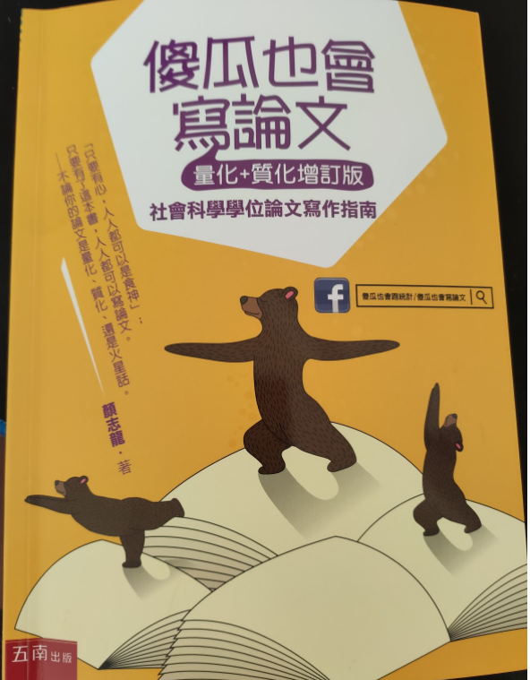

#1.指導教授的選擇

###選擇指導教授的When:何時該開始找指導教授

- 有沒有研究所修過老師的課
- 有沒有實際相處過的經驗
- 彼此互動過程中的感覺如何
- 才是選擇教授比較合理的判準。

###選擇指導教授的How:個性和思考風格是重點

- 重點：彼此的個性是否契合，彼此的思考是否能對焦
- (1)您能很快理解他所說的事情
- (2)您覺得他講的東西都很有道理
- 錯誤的想法：您是郭靖，找一個黃蓉當指導教授，或是令狐沖，找岳不群，兩個人下場都很慘。


###選擇指導教授的Who。:專長和名氣沒有想像中重要。

- 同一學科的老師，都有能力指導您的初階學術論文，教授的專長沒有那麼重要。
- 大師不見得會付出多少時間在指導學生身上

###選擇指導教授的What:老師在想什麼?

- 不要不好意思，也不要怕得罪教授，勇敢去接觸，才能知道合不合


#2.論文主題的形成與文獻閱讀

###論文主題來自何方:「現象」、「文獻」、「理論」

- 寫論文最困難的時候，就是沒得寫的時候
- 找論文的題目，可以分「現象」、「文獻」、「理論」
- 現象：最為複雜，可遇不可求
- 文獻：最具體，最省時間，已去除掉雜訊
- 理論：理論是文獻的統合，如果您的研究來自於某個理論，只要鎖定和這個理論有關的文獻，就可以讓您輕鬆寫論文第二章(文獻探討)中的大部份內容。


###問題意識的形成:變項式思考

- 論文都有關鍵字，可以試著思考關鍵字與論文關係。然後換掉幾個關鍵字，再思考架構有沒有可能改進，

###有效率的文獻閱讀

- 這篇論文寫什麼東西，先看摘要。
- 讀論文沒有捷徑，英文是內功，只有不斷的讀。
- 有「目的性」去讀論文，比如：這篇論文跟我的論文有什麼關係，沒有關係，就不用浪費時間去讀了
- 讀文獻的demo


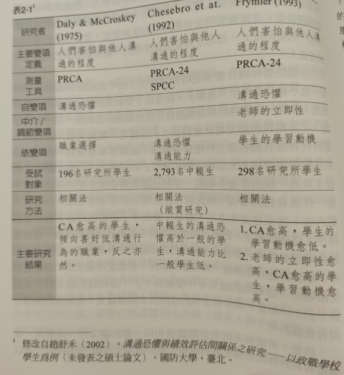

###繼承家業、呼朋引伴

- 繼承家業：跟您的教授，做相同的主題
- 呼朋引伴：同門之間做相同的主題，資源共享
- 隨時記錄自已的想法也很重要。


#3.<研究動機與目的>的撰寫

###社群的動機目的vs.個人的動機目的

- 注意：動機是對讀者寫的，不是對自已寫的，才有意義。
- 研究動機，寫成這樣就對了

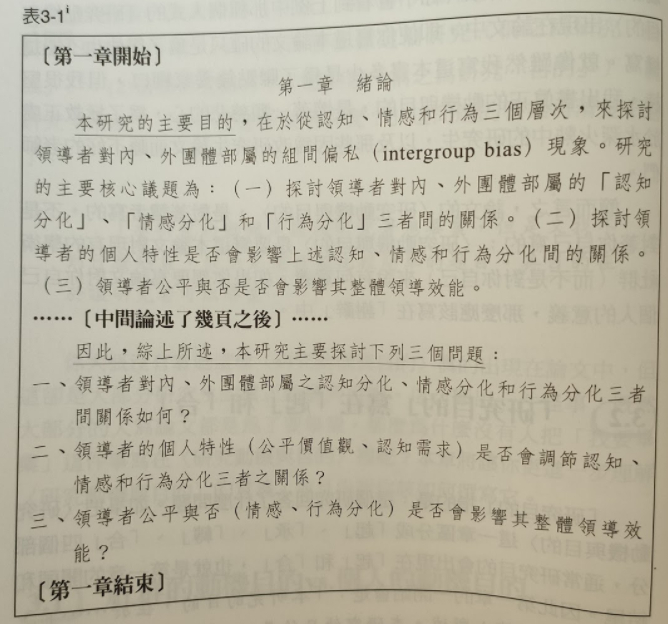


###「研究目的」寫在「起」和「合」

動機這樣子寫
```
「儘管過去關於此一議題之研究甚多,但研究者發
現過去研究有以下幾點不足……」
「過去關於此一理論的研究,甚少探討到…
...因此。
本研究適可補足過去理論之不足……」
「本研究以○○○出發,去探討此一議題,以此種
角度探討此一現象,具有以下優點……」
```


因此,寫「研究動機」的原則非常簡單,要寫三件事:
(1)簡單回顧過去關於此一主題的現況;
(2)說明過去研究有什麼不足:
(3)你的研究如何能彌補他們的不足;這三件事就是你的研究動機。例如


###「研究動機」寫在「承」和「轉」

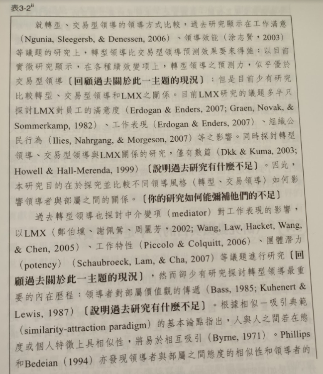


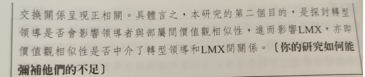


###<研究動機與目的>不是老王賣瓜

- 要表達的見解，以文獻為主，不要用自已的偏見去解釋


###<研究動機與目的>是<文獻探討>的簡潔版

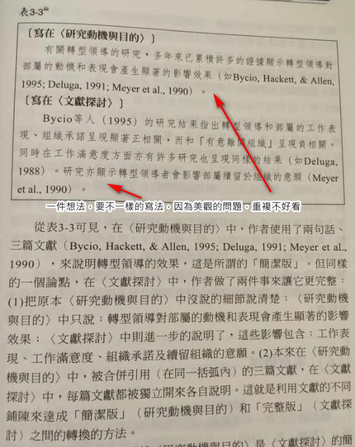

###本章摘述。


# 4.<文獻探討>的撰寫
### 第一步「架構」:列出各節的名稱

論述的流暢性是決定「文獻探討」最重要的考慮

您的變項有幾個，這麼變項的影響是什麼？那個好寫？順序為何？

作者的建議如下：


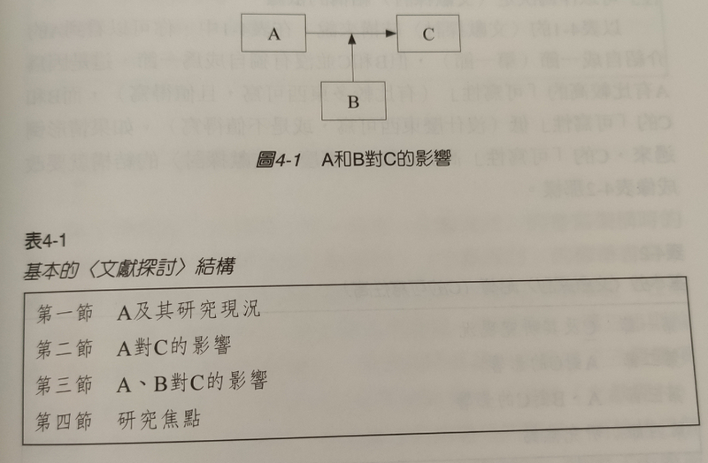
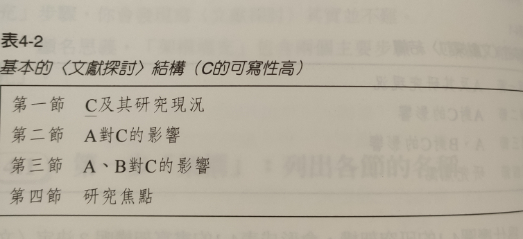
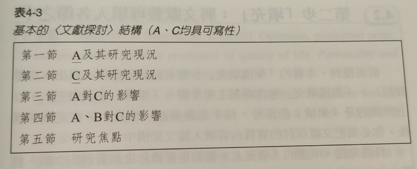


###第二步「填充」:將文獻整理填入各節之中。

- 閱讀文獻時作筆記摘述
- 列出論文的架構
- 將摘述填入各小節中


###書寫的三段格式:「過去」、「現在」和「未來」

以英文所謂三個w來說,<文獻探討>的重點是
- Why(根據過去文獻,你為何有這些想法),
- how<研究方法>的重點是你如何執行研究)
- 而(研究結果>的重點則是What(你發現了什麼)


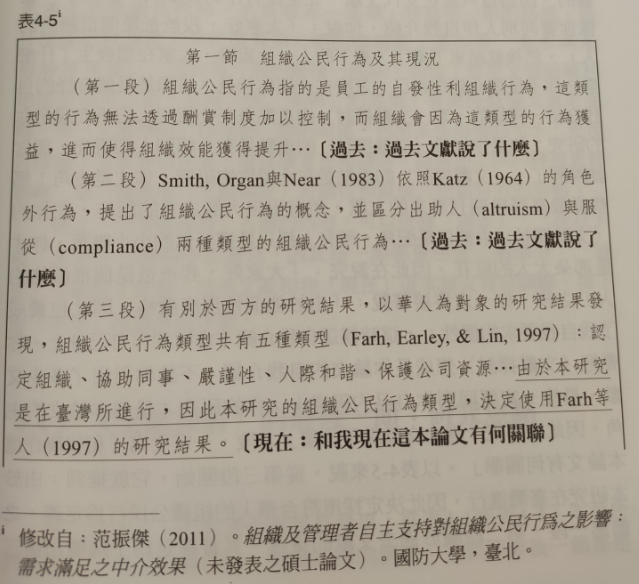

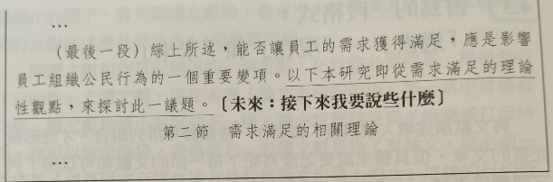

最後,在表4一5的未段,作者寫道:「…以下本研究即從需求滿足的理論性觀點,來探討此一議題」作為第一節的結尾。

為什麼要這樣寫呢?

你仔細看第二節的標題是「第二節需求滿足的相關理論」,因此第一節的最後一段話,

是為了要使文章能順利地連接到第二節,它是一種「串場」的效果,會使得整個文章更流暢。

寫<文獻探討>時在每一節的結尾,利用某些串場的句子,先預告你接下來要論述什麼,會使讀者在閱讀時,節與節之間的轉換更為順暢,是一種增加<文獻探討>可讀性和說服力相當有效的策略。

總之,(文獻探討>各節的內容,可以依據「過去」、「現在」和「未來」三個順序去書寫,因此每一節都會包含三個部分:「去」文獻說了什麼,這些文獻和我「現在」這本論文有何關聯,接來(未來)我要說些什麼。


### <文獻探討>的最後一節:研究焦點

研究的重點，要在撰寫中，不斷提出，增加閱讀文章的流暢性

### APA格式。

很繁鎖的文件格式規範，建議研究生，還是自已手動調整，避免日後匯入學術網站會出錯


### 什麼是抄襲?

引用段落的出處，要 寫出來，不然就是抄襲


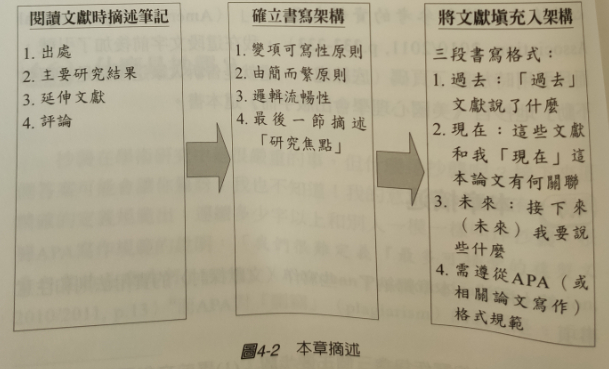

