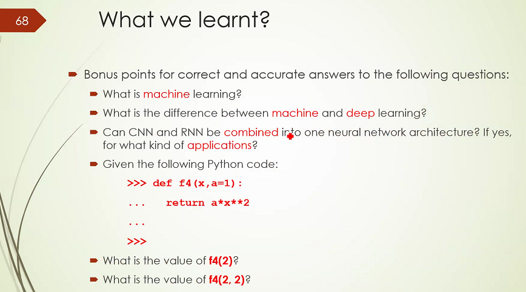
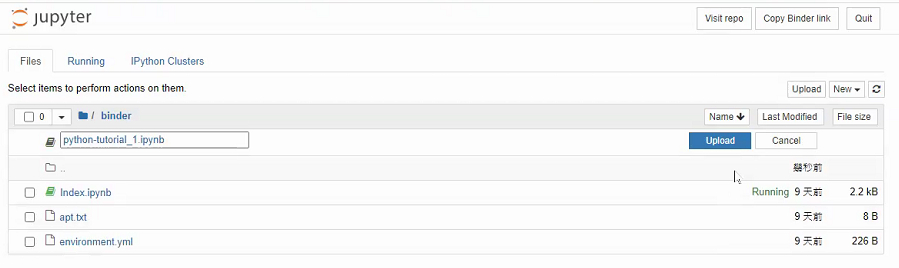
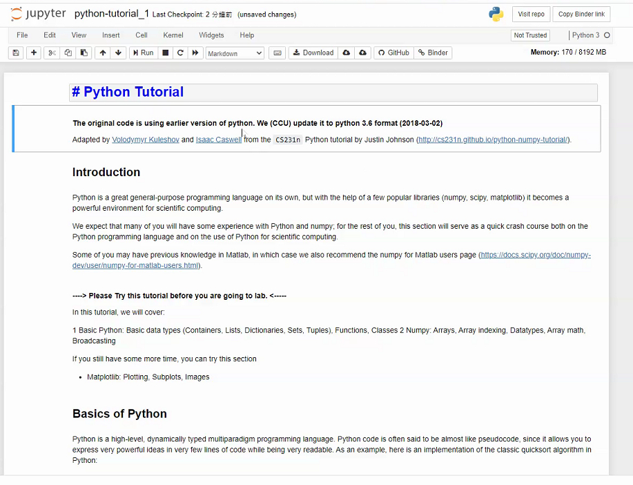
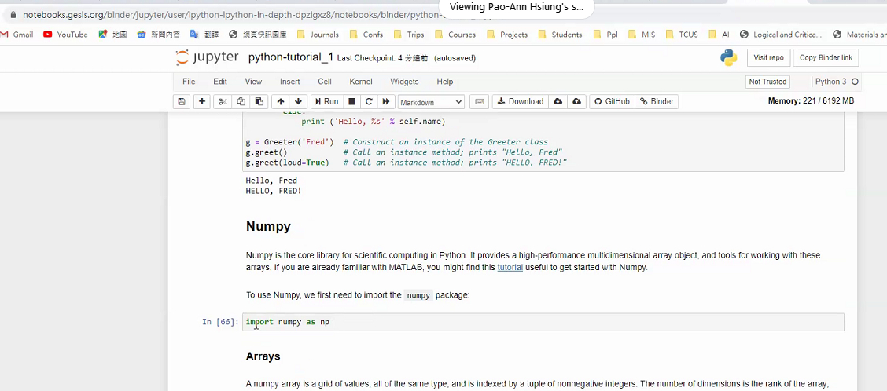

### 01


### 02


```
關於課程
歡迎參加為期2天的深度學習基礎課程！！！
期待什麼？
使用Python從頭開始，如何創建ovv•n深層神經
neWvork模型？
低調和優化您的模型？
演講形式
前兩個小時：熊博士的演講
前1小時：編程任務（在線開始工作，離線完成工作}
課間休息1分鐘
必須完成所有編程任務才能獲得e，證書。
```


### 03


### 04


### 05


### 06


### 07


```
Supervised: Learning with a labeled training set of data
example : learn the classification of images based on image labels (dogs/catsj day time, numbers, etc.)

unsupervised: Discover patterns in unlabeled data 
example: cluster similar documents based on text

Reinforcement learning: learn toact based onfeedback/reward
Example: learn to play reward: win or lose

監督下：使用標記的訓練數據集進行學習
示例：根據圖像標籤（狗/貓的白天時間，數字等）學習圖像的分類

無監督：發現未標記數據中的模式
示例：基於文本聚類相似文檔

強化學習：根據反饋/獎勵學習行動
例子：學會打賞：贏或輸
```


### 08


```
Machine Learning in Practice
Most machine learning methods work well because of human-designed representations and input features
ML becomes just optimizing weights to best make a final prediction
實踐中的機器學習
由於人為設計的表示形式和輸入功能，大多數機器學習方法都能很好地工作
ML只是優化權重以最好地做出最終預測
```
### 09


### 10


```
• A sub-field of machine learning for learning representations of data.
• Exceptionally effective at learning patterns.
Deep learning algorithms attempt to learn (multiple levels of)representation by using a hierarchy of multiple layers
• If you provide the system tons of information, it begins to understand it and respond in useful ways.
•機器學習的一個子領域，用於學習數據表示。
•在學習模式上非常有效。
深度學習算法嘗試通過使用多層層次結構來學習（多個級別的）表示形式
•如果您向系統提供大量信息，它將開始理解並以有用的方式做出響應。
```

```
deep learning : 特徵提取•分類
```

### 11


```
DL為什麼有用？
o手動設計的功能通常被過度指定，
不完整，需要很長時間進行設計和驗證
o學習的功能易於適應，學習迅速
o深度學習提供了非常靈活的（幾乎是？）通用的，
用於表示世界，視覺和語言信息的可學習框架。
o可以無監督和有監督的方式學習
o有效的端到端
聯合系統學習
興趣超過
o利用大量的培訓數據
```


### 12


### 13


### 14


### 15


### 16


### 17


### 18


### 19


### 20


```
神經網絡動物園
各種神經網絡的圖形符號
http：//www.asimovinstitute.orq/neural-network-zoo/
神經網絡遊樂場
一種在線互動方式，可與不同的網絡體系結構進行交互
http：//playground.tensorflow.orq
8深度學習的啟發性應用
深度學習非常有趣的應用
http://machinelearningmastery.com/inspirational-applications-deep-
學習/
```

### 21


黑色圖片自動上色


### 22


```
（2/8）自動添加聲音
兩種類型的NN
大型CNN圖像
大型長期短期記憶（LSTM）遞歸神經網絡（RNN）
聲音
http://news.mit.edu/201 6 / artificiaI-inteIIigence-produces-reaIistic-sounds-0613
視覺指示聲音（MIT）
http://vis.csail.mit.edu/
VideO（2.54 s）
https://youtu.be/OFW99AQmMc8
```

### 23


### 24


### 25


看影片，加入聲音


### 26


### 27


### 28


```
（4/8）物體分類與檢測
在照片中
大型深層CNN
關於ImageNet分類的論文
http://www.cs.toronto.edu/—fritz/absps/imagenet.pdf
```

### 29


### 30


### 31


### 32


### 33


### 34


### 35


### 36


### 37


### 38


### 39


### 40


### 41


### 42


### 43


### 44


### 45


### 46


### 47


### 48


### 49


### 50


### 51


### 52


### 53


### 54


### 55


### 56


### 57


### 58


### 59


### 60


### 61


### 62


### 63

### 64

### 65

### 66

### 67

### 68

### 69

### 70

### 71

### 72

### 73

### 74

### 75

### 76

### 77

### 78

### 79

### 80

### 81

### 82

### 83

### 84

### 85

### 86

### 87

### 88

### 89

### 90

### 91

### 92

### 93

### 94

### 95

### 96

### 97

### 98

### 99

### 100
