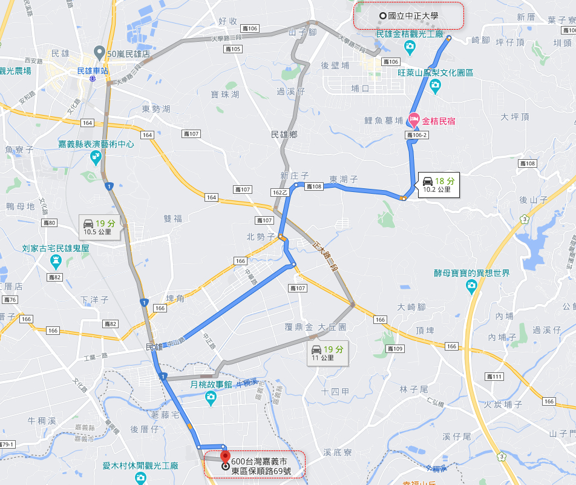
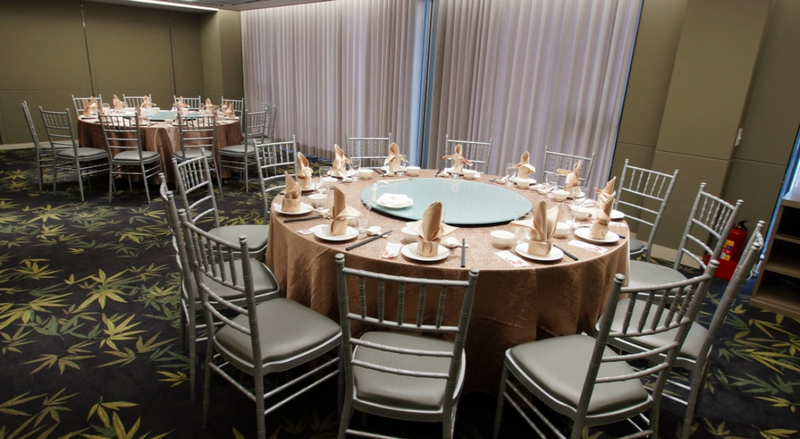
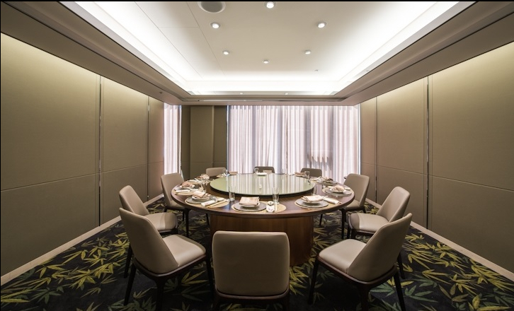
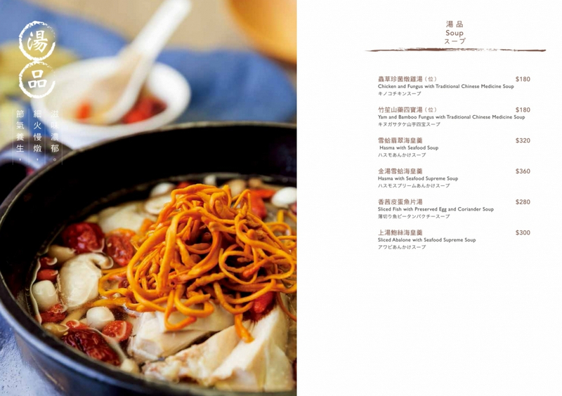
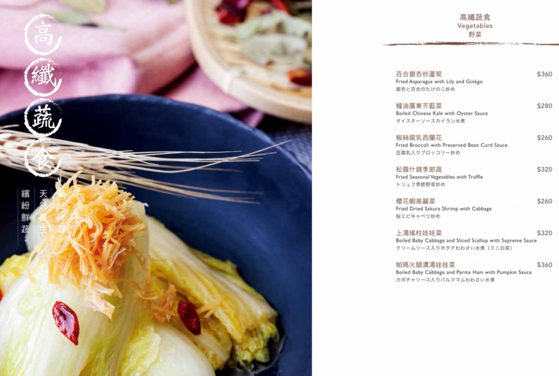
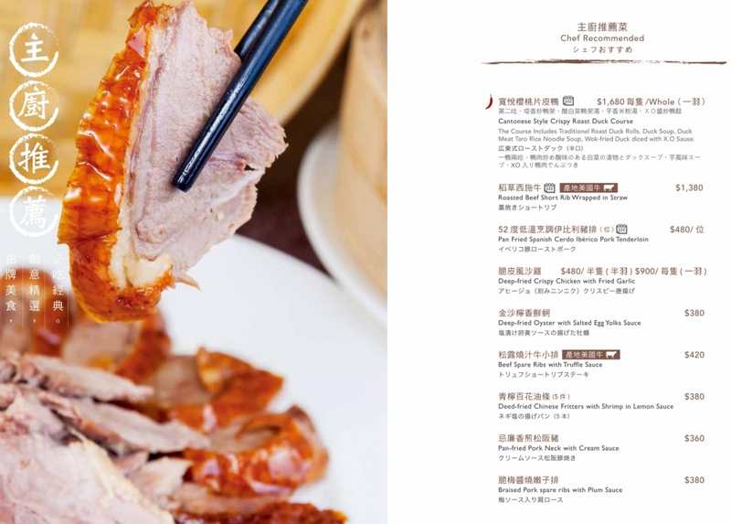
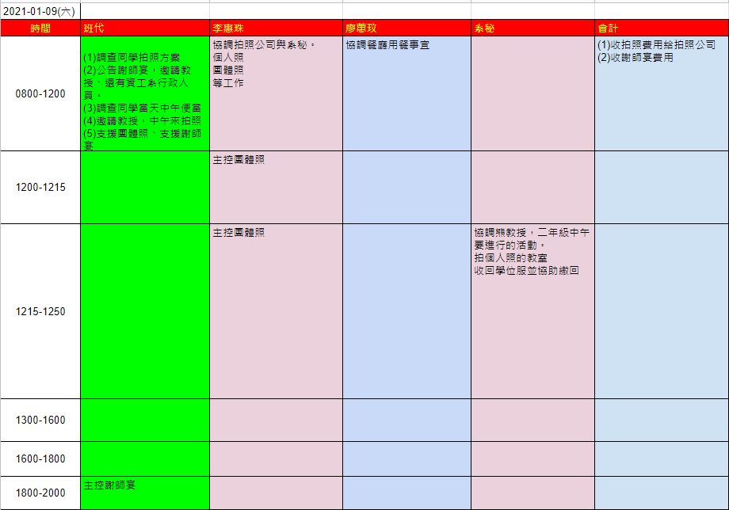

# 2021年 01月 09日(六)

## 01、重點

- 12:00，著正式學位服，拍團體照

- 18:00 謝師宴

- 20:00 活動結束

- 當天，請繳 畢業照費用予拍照公司

- 當天，謝師宴，每位同學收 $500元，為活動費用。

- 畢業照收費：依下列鏈結
  - [畢業照方案調查](http://123.57.20.183/serp/yu/stuEvent/s/photo_list.asp?eventid=16)

- 中午的便當調查
  - http://123.57.20.183/serp/yu/stuEvent/s/eat_list.asp?eventid=10

- 謝師宴
  - 日期：2021年 01月 09日（六）
  - 時間：18:00
  - 餐廳名稱：頤奧軒
    - https://www.hsinhotel.com.tw/banquet-detail/41/
  - 地點：  600 嘉義市東區後湖里保順路69號(新悦花園酒店)
  - 可以帶親友來，請先跟班代說，訂位還是要盡量掌握實際參加人數。一人$500。

## 02、規劃表(當天班代會依此表，來推動各行程)

