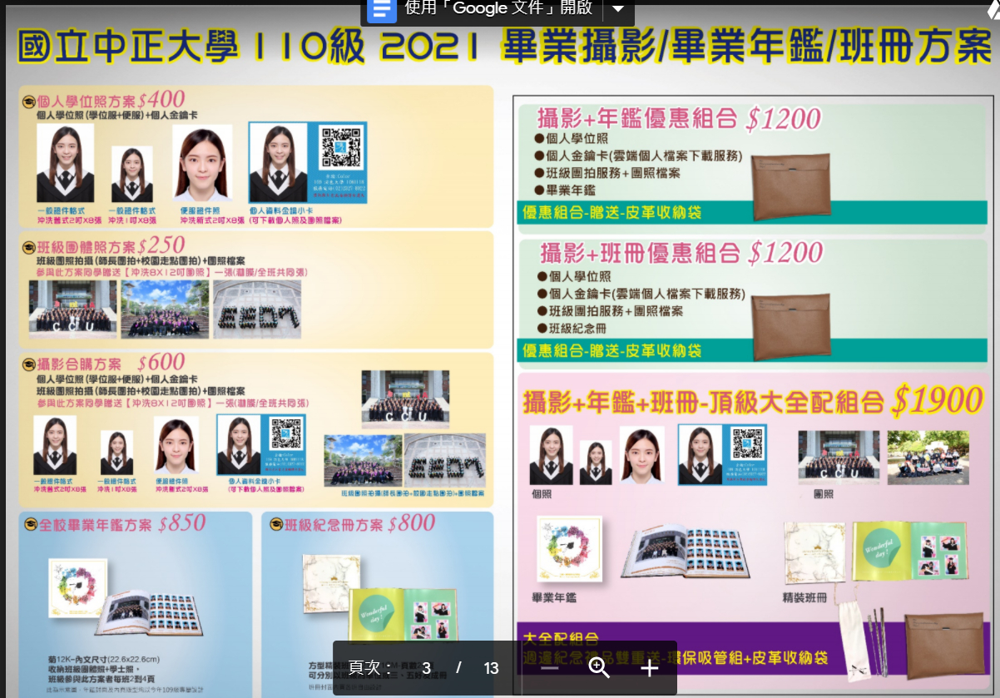
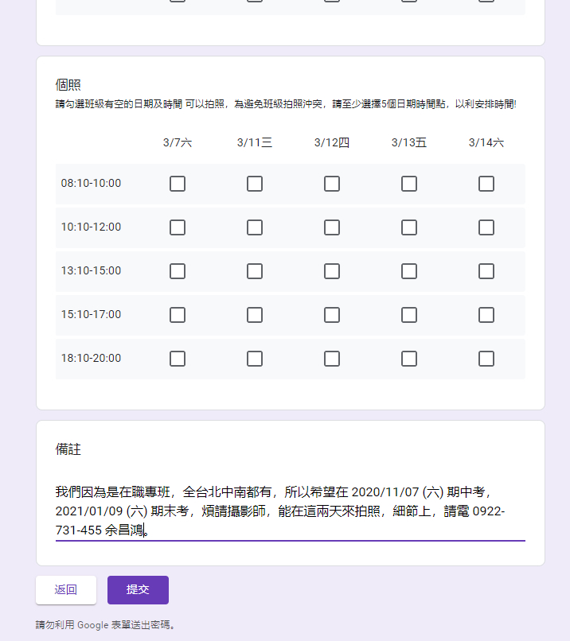

# 前言
- 我們是大人了，凡事求圓，必有取捨。
  - 畢業餐會，有可能改在明年，因為拍照(個人照、團體照)、跟聚餐，同時處理，太困難，目前等拍照的事情再清楚些，再考慮畢業餐會的事宜。
  - 學位服，就是個人保管，個人借到明年還給系秘，不見了要賠錢，合理。
   
- 學位服：
  - 個人在10月19日至11月1日止，登記。後面由系秘去借，班代會在期中考收錢。
  - 明年5月、6月有畢業典禮，學位服，自已保管至明年，自已歸還。
  - 該跟同學催錢時，班代會在群組通知。

- 畢業攝影/年鑑/班冊方案選擇

  - 基本上，班代傾向 $1,900。大全套，省事，當然，自已應該也可以選擇其他方案。

- 系所團體拍攝及個人拍攝時間

  - 已回報，希望在期中考，期末考, 找攝影師來拍照

- 攝影方式說明及注意事項，自已看圖片說明

### 201107(六) 學位服，租借事宜

### 1.學位服租借時間以及方法

[圖片：學位服，借用注意事項](01.jpg)

[圖片：學位服，借用流程](02.jpg)

- 學位服網路團借開放登錄時間10月19日至11月1日止

- 預約領取學位服時間（11月2日至11月13日止，上班日上午9：30至11：30，下午2時至4時）

### 2.畢業攝影/年鑑/班冊方案選擇

[圖片：畢業攝影/年鑑/班冊方案選擇](03.jpg)

【方案登記GOOGLE表】

GOOGLE登記表，請畢代公告請同學10/11日前填寫，我們可以整理一波班級明細。

- 10/11日前填寫
- 10/20公告，修改、填寫至10/25(日)

[表單：中正大學畢業攝影/畢業年鑑/班冊方案](https://docs.google.com/forms/d/e/1FAIpQLSd-CQqvR02pxQGADa44s3d9-yvx6zlwhU145_kzZRltkVmOPQ/viewform?fbclid=IwAR3D_uCDaextE7p53TDmOSDYSwSmE4FhL_DC4oLChARO-WBZSxmXPmvrhvg)

### 3.系所團體拍攝及個人拍攝時間

【畢代回覆團個拍選擇時段】

- 10/25(日)可看各班參與團個拍方案人數，回覆可選擇拍照時段

[表單：中正大學團個拍照時程調查](https://docs.google.com/forms/d/e/1FAIpQLSfojvltLrt6qKiFANPc3Kxp3ZE_kS-z19hLt9tJknT_j-as5g/viewform?fbclid=IwAR2lkb5hX9Mx3H2br4KtBt1funsxLsL-YYlLGlz4mIixly8ASGYyPUOr_jg)

### 4.攝影方式說明及注意事項

[圖片：攝影方式說明及注意事項](04.jpg)

請各位畢代轉告系上同學，務必於期間內完成，以利資料統計跟作業實施，如果有任何問題都可以直接在社團提問，會盡快幫大家解答的！謝謝大家配合。

此外～～～～～～

歡迎大家加入畢委會幫忙，也幫我轉告系上同學歡迎加入畢委會，拜託大家了