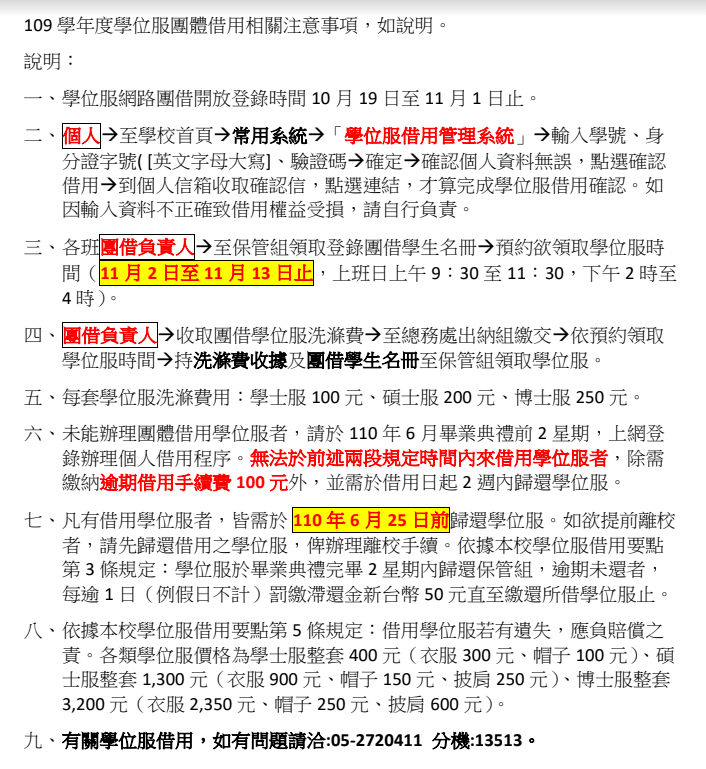
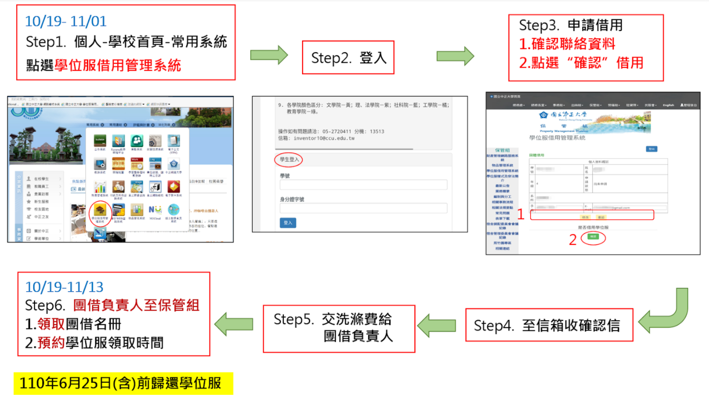

### 1.學位服租借時間以及方法

學位服網路團借開放登錄時間10月19日至11月1日止

預約領取學位服時間（11月2日至11月13日止，上班日上午9：30至11：30，下午2時至4時）

### 2.畢業攝影/年鑑/班冊方案選擇

https://drive.google.com/....../1wvlRW....../view......

【方案登記GOOGLE表】

GOOGLE登記表，請畢代公告請同學10/11日前填寫，我們可以整理一波班級明細。

10/20公告，修改、填寫至10/25(日)

https://docs.google.com/....../1FAIpQLSd....../viewform

### 3.系所團體拍攝及個人拍攝時間

【畢代回覆團個拍選擇時段】

10/25(日)可看各班參與團個拍方案人數，回覆可選擇拍照時段

https://docs.google.com/....../1FAIpQLSfojvlt....../viewform

###　4.攝影方式說明及注意事項

https://drive.google.com/....../1mVPXyM8CMP....../view......

請各位畢代轉告系上同學，務必於期間內完成，以利資料統計跟作業實施，如果有任何問題都可以直接在社團提問，會盡快幫大家解答的！謝謝大家配合。

此外～～～～～～

歡迎大家加入畢委會幫忙，也幫我轉告系上同學歡迎加入畢委會，拜託大家了