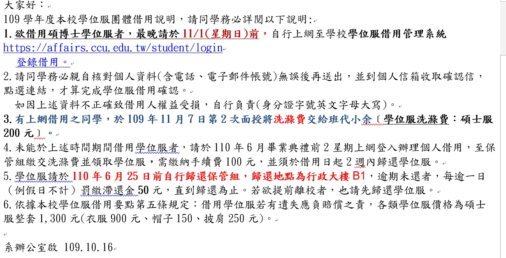
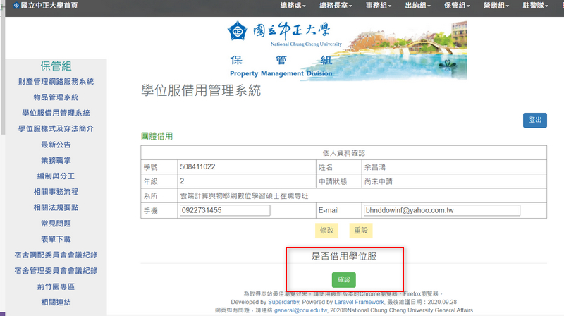
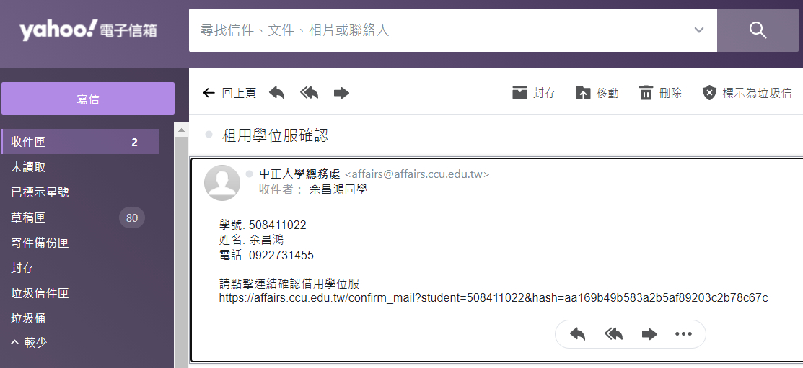
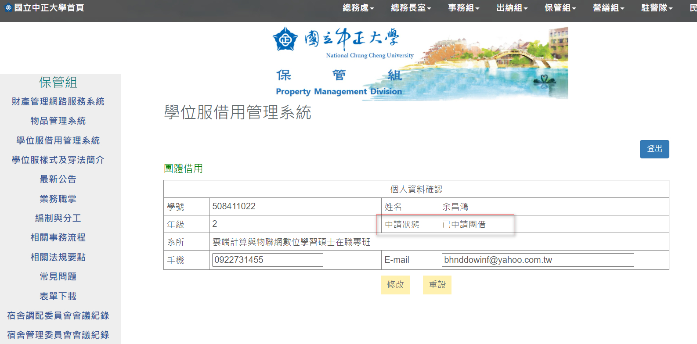

### 201107(六) 學位服，租借事宜

# 重要：學位服，自已借，自已保管，自已在明年學校畢業典禮還給系秘，一次 $200，班代會跟您收錢。

- 上列為學位服借用重要事項公告，若有要借學位服之同學，請務必於學校規定時間內上網登錄，截止時間至109年11月1日。請大家留意!謝謝!
- 借用時段從今天開始到11月1日截止~大家務必保握時間~若沒有在規定時間內借用~必須罰手續費並借用時間縮短~所以不划算~請大家留意!謝謝!
- 11/7就可以學位服會交給班代會來來發~
- 另11/7 費用麻煩請同學準備好 $200，班代會來收錢~

### 實作租用流程

- 總務處學位登記網址：https://affairs.ccu.edu.tw/student/login
- 輸入學號、身份證
- 是否借用學位服→是

- 到自已的信箱，將鏈結，複製至 瀏覽器

- 完成畫面

