### 01
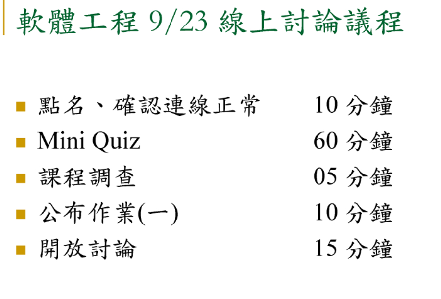


### 02
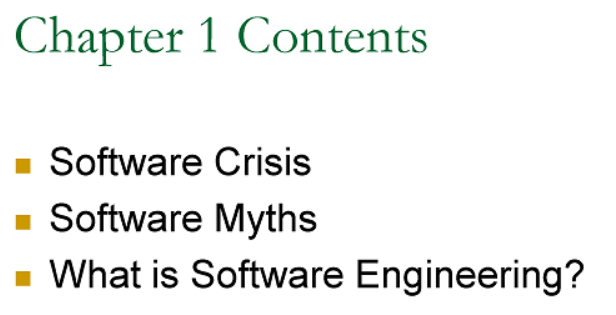


### 03
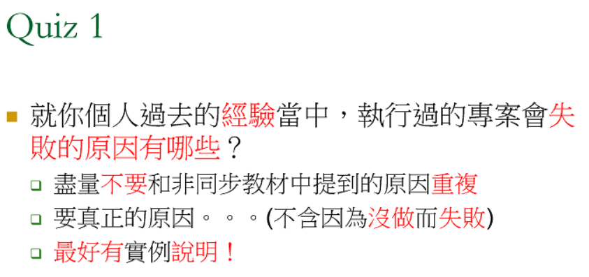


### 04
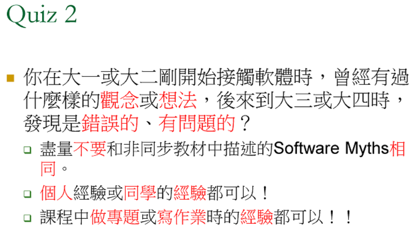


- >老闆硬要做，做出來了，沒人用。
- >組員吵架吵到做不下去......
- >客戶需求不段發散~
- >規格不清
- >公司做到沒錢了
- >功能性不佳
- >資金不到位
- >請問是用打字的嗎?
- >對
- >預算不夠
- >客戶的需求在初期未能完全說明清楚，後續持續增加功能，導致人力預算爆了
- >規格超出可支持的範圍
- >時程要求不合理
- >想要的東西太多 結果能力不夠 
- >專案沒有在與日後上線相同的環境進行過測試，而導致在上線後出現未預期的問題
- >老師可否簡述什麼是失敗
- >硬體實測時,軟體沒能Demo成功
- >一直開新的需求導致專案太過發散
- >不符合消費者習慣性
- >能力不夠
- >設備不足預算
- >過程太過僵硬 無法適時的彈性修正
- >客戶不了解自己的需求
- >PM需求模糊不清一再更改,與客戶之間溝通有問題導致專案一在延遲
- >工程師離職交接未清楚
- >準備期中考或期末考的讀書計畫時程，因為複習中發現自己不熟練的地方，所以花了比預定時程還多的時間
- >主包商擺爛
- >客戶搞不清楚自己要什麼
- >人員流失
- >立場不一致,公部門做自己的需求,沒充分溝通,業者一講話就沒辦法上線
- >專案須配合硬體，預算不足無法購買
- >SPEC沒看清楚超過預估時程，最後預算不足只能作一半收場
- >花的錢少 要做出的東西太多
- >計劃太遠：當只有兩個月的路線清晰度時，卻計劃了一年的工作量。
- >剛開始的資源規劃(Scope、Schedule、Cost)就失準
- >使用者無法配合驗收
- >沒備用方案 台灣只有中研院有那機器 但開始沒多久機器就壞了
- >系統資料匯入沒有自動化，還需人力keyin資料，反而增加使用者負擔，造成使用者不願意用
- >先搶標案, 但是最後發現規格無法達成
- >跨部門無法整合
- >常常修改方案 方向不明
- >做不完又不能追加預算
- >低價搶標,遇到軟體蟑螂
- >開發人員工作量太大, 無法在時程內承接
- >人員離職
- >只做部分替代性的程式，導致其中使用者的要求無法達到
- >專案中又增加功能
- >合約沒有訂清楚, 造成模糊地帶
- >客戶承辦臨時換人，對契約的漏洞"自我解讀"，造成Scope不斷擴散...
- >發包廠商系統無法整合


### 05
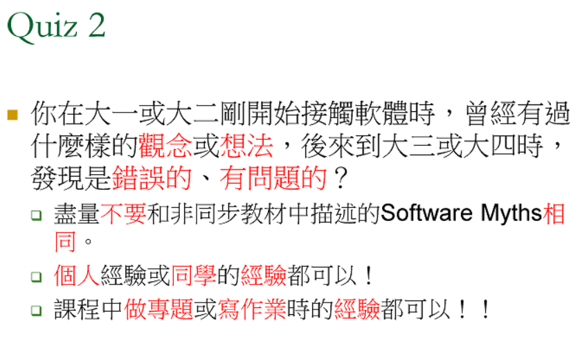

- >我以為我什麼都寫的出來，事實上，我能做的很少。一切都要學習。
- >什麼程式都要自寫，後來覺得拿來套先達到老闆要求最重要
- >在投入開發前，沒有先經過完善的計畫就直接進行開發，導致架構不夠彈性
- >一開始認為Procedural的寫法就可以打遍天下,但專案越做越大時發現有時候需要OOP的觀念才能做出程式碼可維護姓高的專案
- >在開始寫軟體時，常常只會從功能去思考架構，但應該是從需求去長架構最後才是功能
- >習慣使用github上的open source 最後導致專案架構難以維護,且導入了許多不必要的功能
- >程式只要功能work , 當程式愈大愈複雜時, 發現需要有架構才能好維護及移植
- >以為學會一套程式可以撐很久,結果要不斷不斷學習
- >做FPGA專題, 因為不想學程式語言Verilog, 打算用邏輯閘去兜功能, 最後發現同學用verilog寫, 迅速多了, 不用一直畫邏輯閘
- >剛開始因為組員不熟,自己技術不足; 日後人脈熟了,有問題大都可以透過朋友或組員得到解答,或得到組員協助而達成目標!...所以有問題提早提出才會提早把危機變轉機!
- >覺得軟體可以一直用很久，但後來發現會因為沒有升級或硬體不相容而導致軟體不能使用
- >以前剛學的時候覺自己寫程式很難，後來發現看懂別人寫得程式更難~
- >一開始以為軟體程式寫的出來才是重要的，後來發現開發過程中的溝通，搞清楚使用者需求更重要，才不會寫了不符需求的系統
- >維護舊的系統比開發新的更難
- >真正上過有關程式的課程，發現基本概念、數學邏輯公式是很重要的，不然會浪費記憶體和儲存空間
- >新的軟體不見得比舊的軟體更好用
- >一開始以為自己所學的可以解決問題 後來實作之後才發現還有很多需要注意的地方
- >像以前讀設計展示PROTOTYPE只要用阿士伯XD寫出來簡單即可，但在開發的過程中某些需求是很難克服的，需要RD相互配合
- >很認真的想分享作法, 但其實每個人都有自己一套想法
- >以為用越高等的程式語言可以寫出所有的


### 06
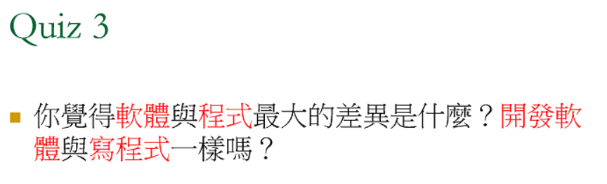


### 07
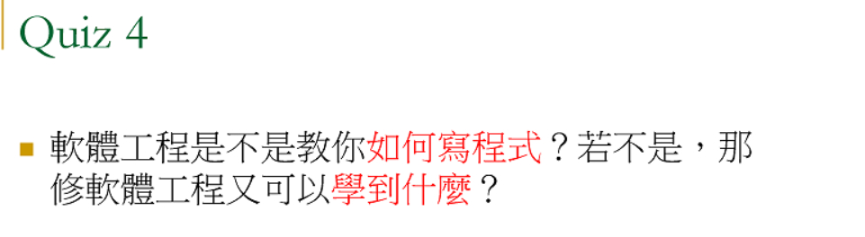


### 08
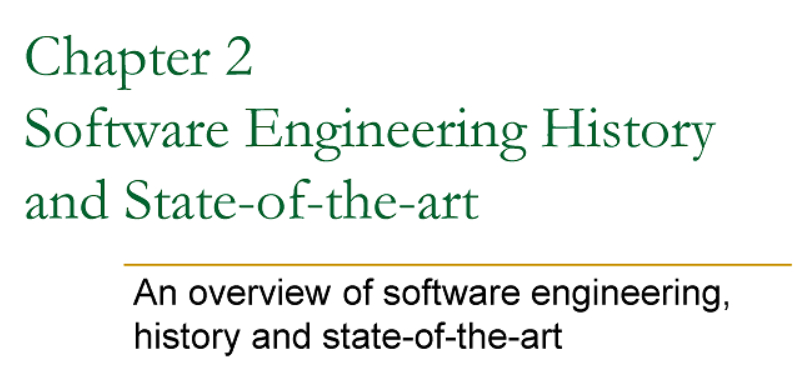


### 09
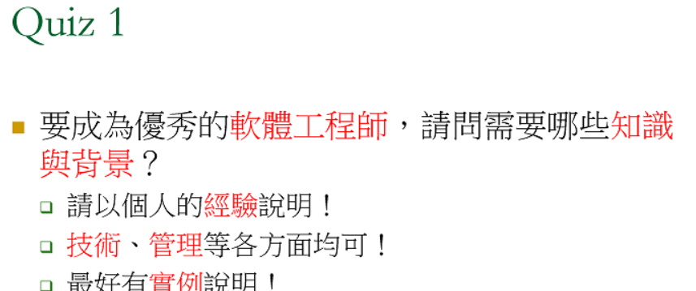


### 10
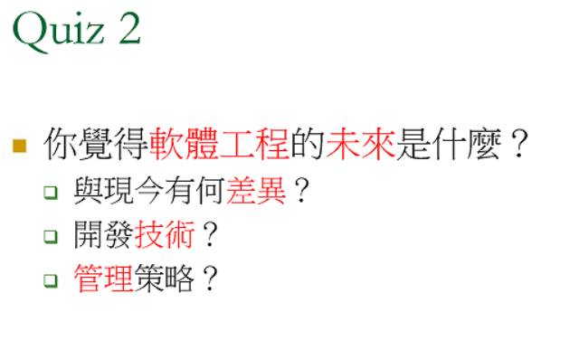

- > 因為現在的軟體，要求功能很多，很精美，所以軟體工程，在多人協同作業場景會越來越多，怎麼讓多人工作如期完成，應該是軟工發展的方向。
- > 配合遠距離趨勢，著重分工、整合...
- >  軟體越來越人性化
- > 越來越多的流程與機制日益自動化
- > 越來越多領域可以互相結合應用
- > 人與電腦協力合作
- > 物聯網
- > AI世界
- > 開發門檻越來越低 
- > 多人協作甚至是機器人協作
- > 專案週期越來越短 速度越來越快 競爭越來越大
- > 接觸的年齡層越低
- > 國際合作
- > 互聯網
- > 版權與開放、授權的問題
- > 軟體工程會變成賣軟體使用的時間服務費,來跟客戶以秒計費(如AI設備使用時間)!或是收某項功能的月費!
- > 越來越簡潔及簡單的語言
- > 安全性
- > 軟體研發簡化 功能性強 安全性
- > 程式語言越來越簡單化，功能模組化，下一個指令就可達到需求，程式碼越來越精簡
- > 情境風險管理，大量的AI控制，是否有失人性
- > 軟體的售後服務也會越來越受重視且必要
- > 外商的主管上班確實很累....
- > 虛擬團隊合作 文化差異
- > 越來越方便大眾使用的系統軟體，以便利人類生活為導向
- > 要更注意法律面的智產權,尤其在用到別人的Code時!
- > iot導入生活
- > 目前AI+ML已可透過一句敍述自動產出視覺化報表
- > 技術團隊越來越多需要整合分布工作需求的能力

### 11
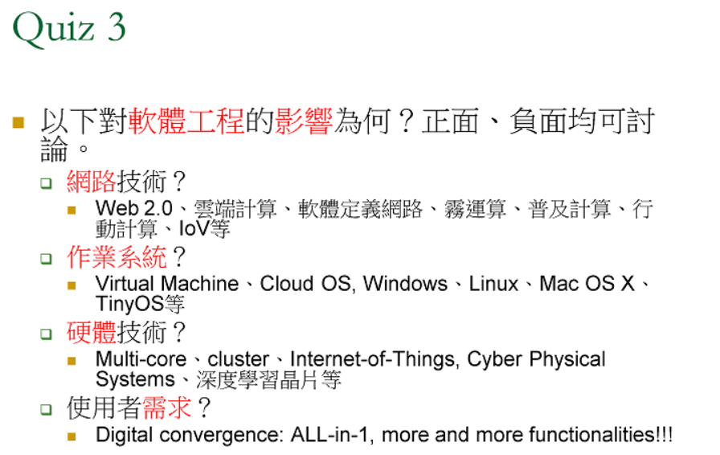

- >作業系統其實是不斷的更新→導致開發的軟體，必須不斷的學，每一年就有新的功能要去學。
- >外在環境變數越來越多，影響運作的穩定度
- >VM可以虛擬測試環境，可以不在現場也可以執行測試
- >各種作業系統造成軟體開發的複雜，例如app就要針對不同的作業系統個別開發
- >雲端VM，一般業者不用再買伺服器減少不少成本
- >VM和docker之類讓開發環境靈活和部署便利許多
- >k8s完美的解決HA與環境隔離
- >霧運算帶動了AIoT(車聯網,物聯網)的興盛; 但也造成為了新功能能提早上市而造成驗證測試不足的車禍頻頻發生!
- >all-in-one,正面看起來對於使用者方便或節省成本，負面是對於軟體不熟悉的人反而更複雜、更難學習，過多功能整合反而更難找到功能
- >再訓練ＡＩ的過程中，強大的軟體需要強大的硬體才可運行完美 
- >有特定的硬體(晶片或卡片), 軟體針對特定功能可以發揮最大的功效, 但是有時候會衍生散熱的疑慮
- >ai的學習技術創照更好的安全性
- >function as a service 讓寫程式與部署更簡單, 但也限制了框架自由
- >透過docker  VM可以快速佈建在各種應用場景中，debug也相當有幫助
- >軟體定義網路，對於非相關專業之技術人員快速學會相關實務操作友善很多~
- >備援系統很重要
- >大多的公司運用前幾大科技巨頭的雲端服務，但中心化的情況下 一旦中心出問題造成的影響是廣泛的
- >各種作業系統之間的相容程度
- >整體複雜程度越來越高(對硬體規格要求),選擇性越來越多,管理上越來越難抉擇
- >負面是專業技術人員不夠
- >教育訓練時間應該會增加
- >以前軟體是買斷, 現在因為要符合軟體日新月異, 交易方式變成Contract一年一簽買的是軟體長期服務
- >系統整合真的很少，光系統上線後的維護作業，就是一個大問題了..
- >對於軟體工程的專業人員各方面要求越來越高

### 12
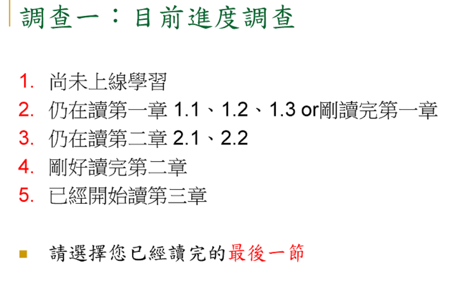


### 13
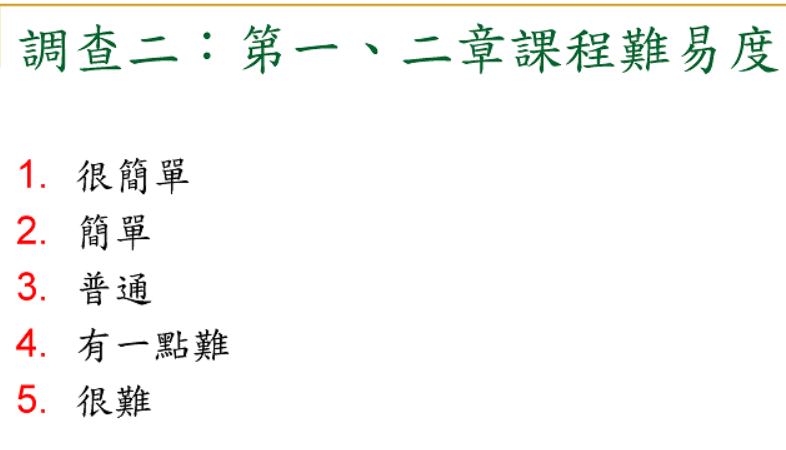


### 14
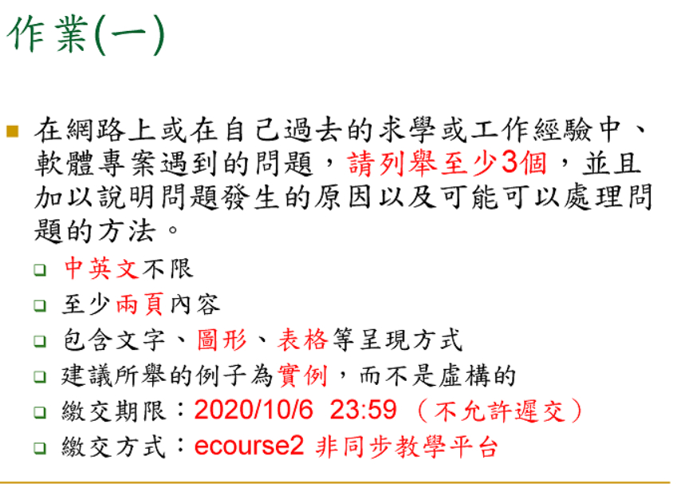

```
請問非相關工作領域,該如何下筆
答：新聞
請問有限直式 橫式 2頁嗎
答：紙是直的，橫的寫
請問還是PDF嗎
答：PDF
```
