### 01
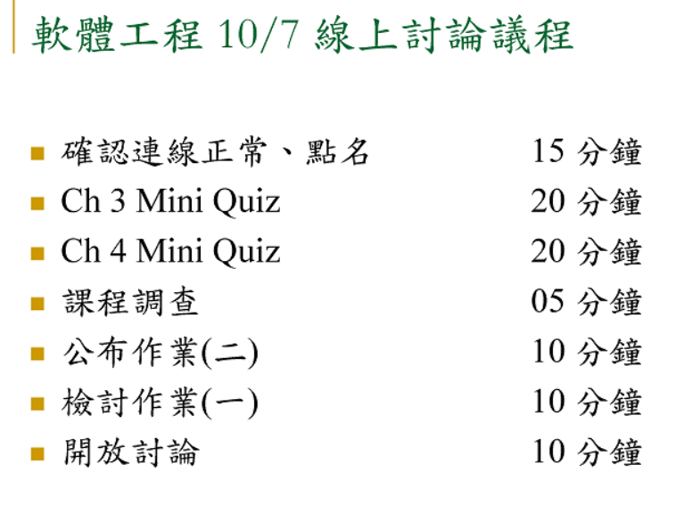

### 02
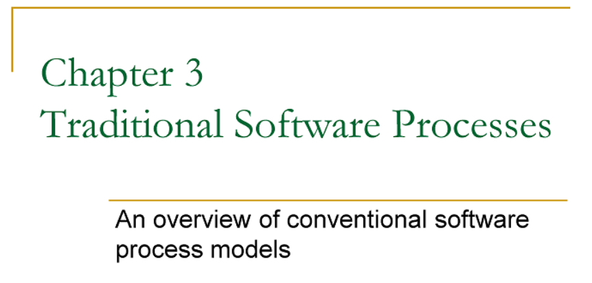

### 03
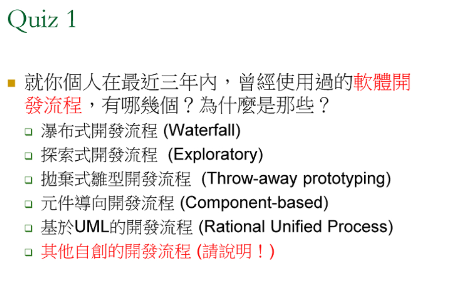


```
本身開發 ERP，很多的業務，都是開發表單,需求者，都已知悉開發技術的範圍 ，故用 waterfall model. 少部份會用 throw-away prototyping, 先跟客戶做初步系統介面、流程是否合適，再來開發。
元件導向開發``由原有的nas系統搭配改動跟增加智慧家電等，或醫療配合系統。
元件導向開發流程~不過是參與機關的網頁開發~這算嗎~現在網頁設計都模組化了~廠商配合機關個別需求直接把有需要的功能模組放上去~
瀑布式加拋棄式
UI介面用拋棄式與客戶討論
元件導向
元件導向開發流程，自動化控制程式
探索式
最近都小需求，剛好有介面不清，使用拋棄式
程式主流程使用瀑布式
主要是瀑布式，但有些專案用元件導向開發
目前實作的專案使用UML開發 , 因為流程圖對於自己比較友善且好懂 
探索式開發，先開發基本的功能，再一步步加上進階的功能
給客戶用的ERP(Throw-away prototyping):在給客戶看過雛型後便再重新開發!
UML 比較直觀
Agile最近開始算
拋棄式-簡單驗證功能或硬體，簡單demo
元件導向能夠很快先產出結果給客戶看~也能當作雛形使用~然後再利用探索式開發討論細節~
UML式 用於產線測試程式使用，透過UML的圖表來與產線工程師一起討論
探索式-客戶部分規格尚未完全定義清楚
```

投票結果：
```
4 最多，UML
1 瀑布式
```


### 04
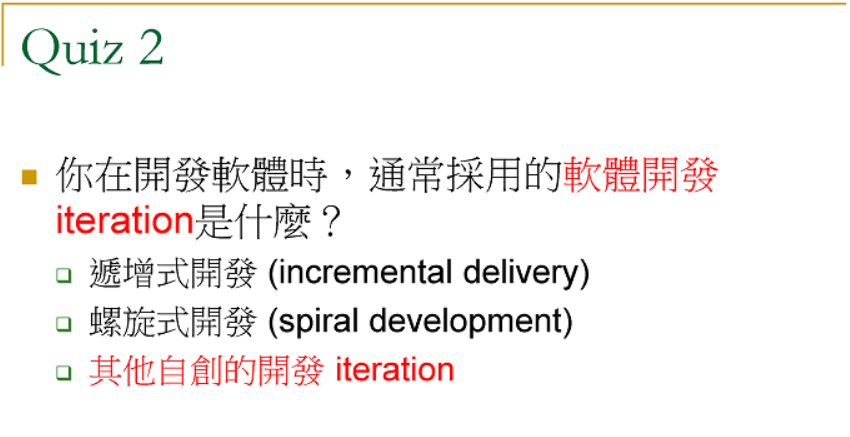

```
遞增式：先設計子系統，再逐步加上系統，會有很多版本的出現，越做越多
螺旋式：先把規格訂清楚，再設計，再測試
```


### 05
這是螺旋式，偏 PM、團隊管理
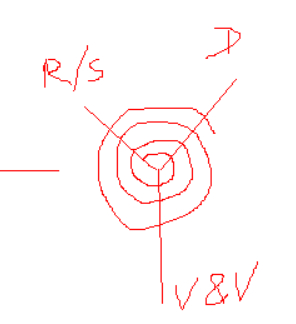

### 06
這是遞增式，從底層做
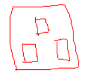


### 07
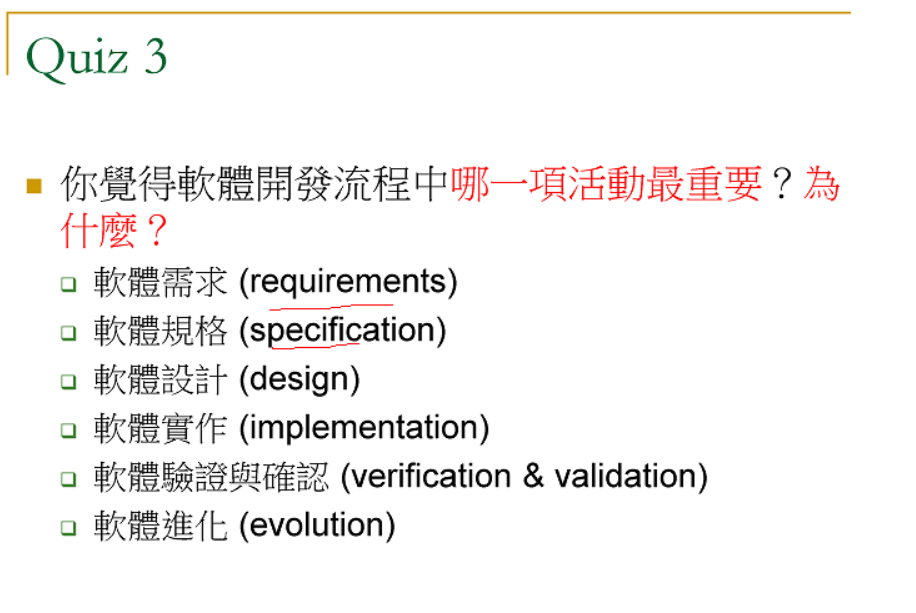

```
需求：自然語言
規格：UML去撰寫
設計：
實作：CODING
驗證與確認：規格測試與接受度測試
進化：版本管理
```


### 08
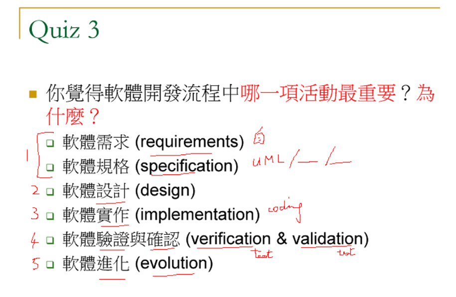

投票

```
```
### 09
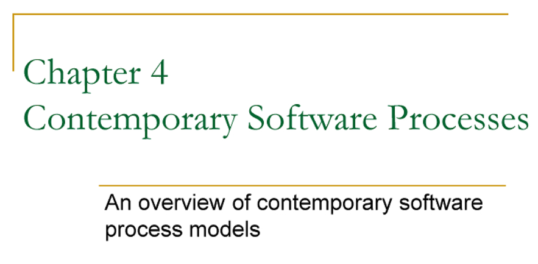

### 10
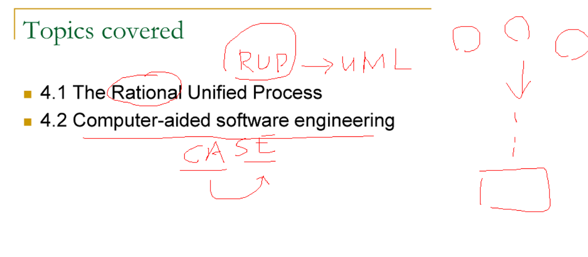

### 11
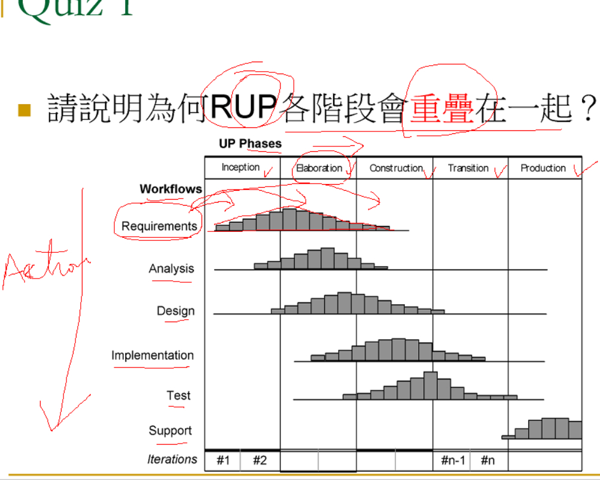


```
UP phases (統一程序)
Wrokflows(工作流程) : active
```

老師：各階段都有各自的需求，省短時程，分析時就要開始理清。

### 12
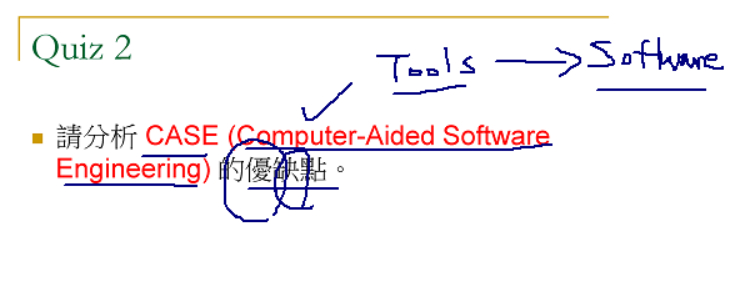

```
優點：快速、 節省開發時間
缺點：缺乏彈性，垃圾進，垃圾出，成本提高，人要更小心
```

```
tools：單一工具
workbench：多工具的整合工作鏈(如：設計階段、測試階段)
environments：整合式開發環境
```

### 13
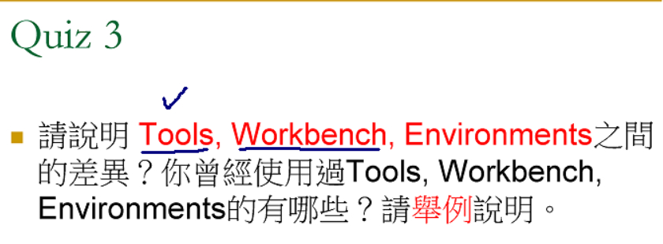

### 14
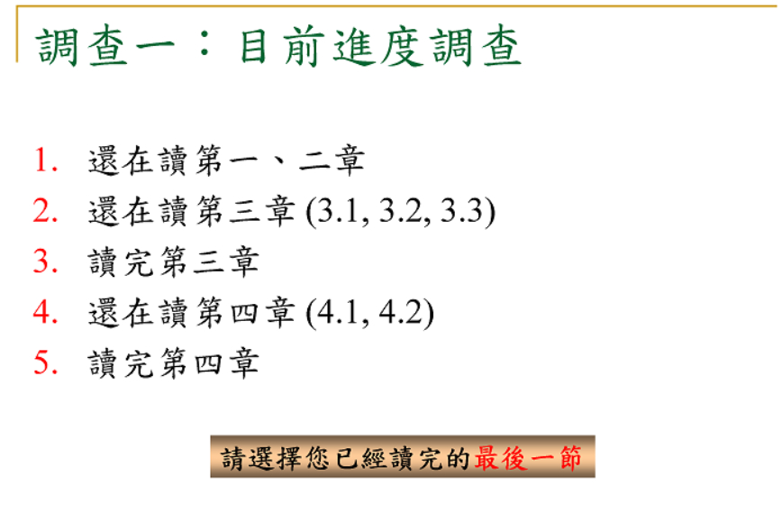

### 15
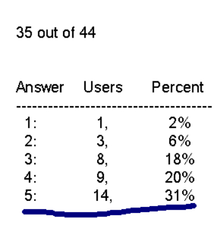

### 16
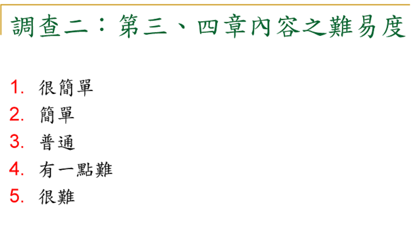

### 17
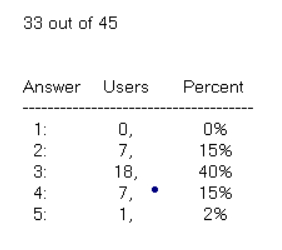

### 18
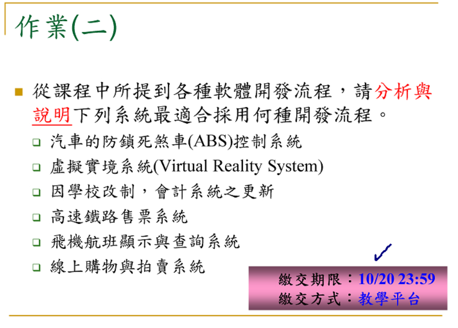

```
說明與分析，老師要求要寫清楚
```
### 19
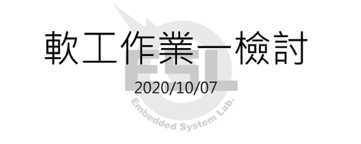

### 22
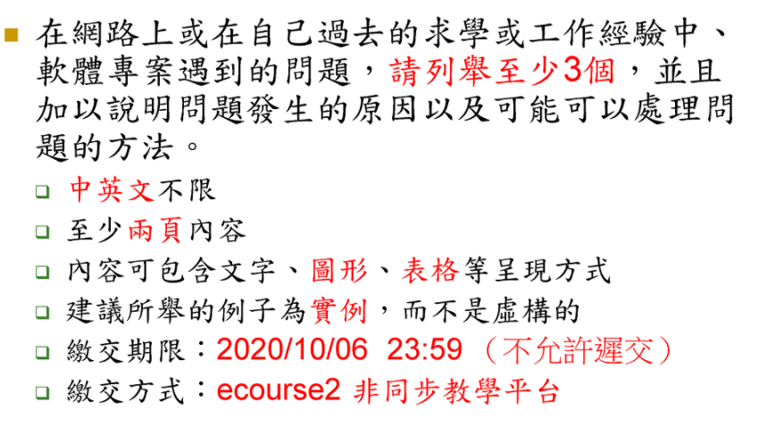

### 20


### 21
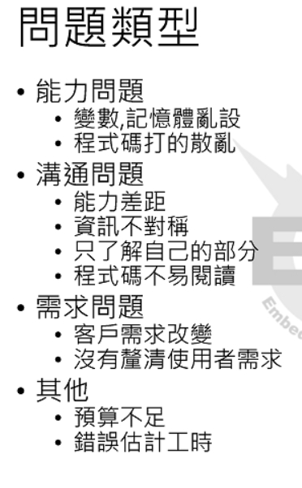


### 23
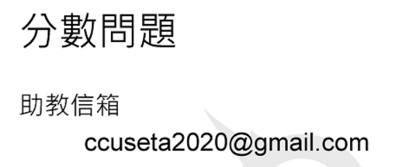
