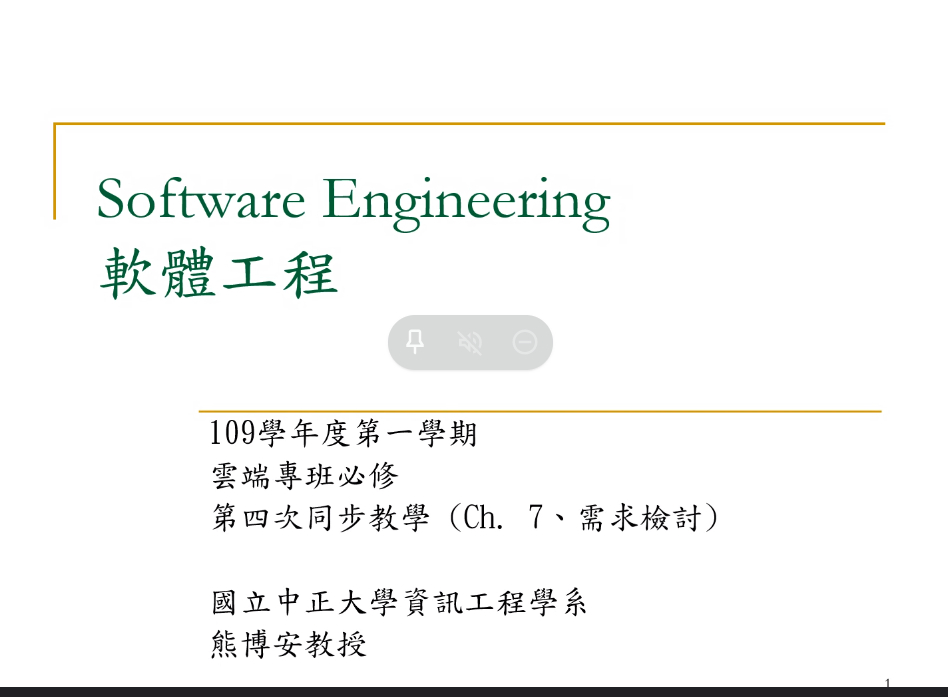
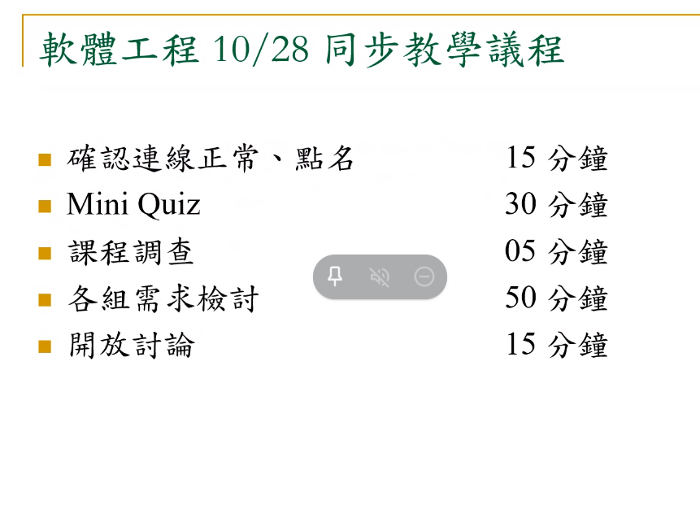
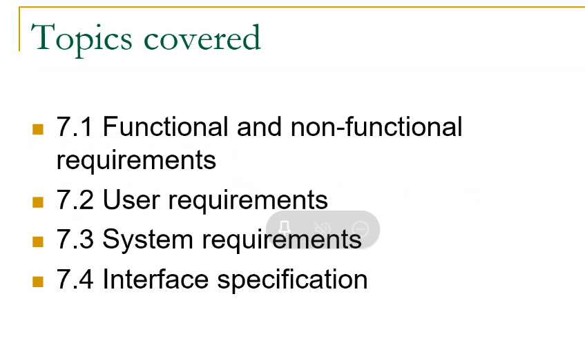
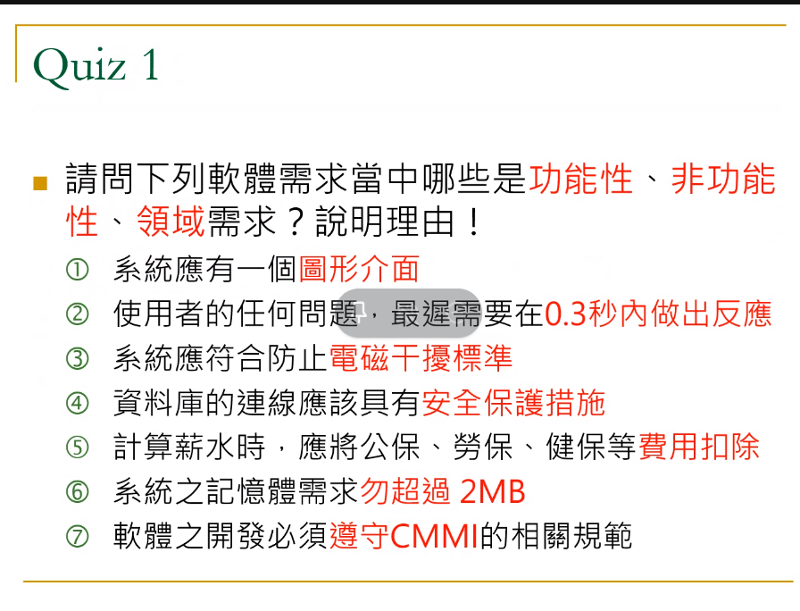
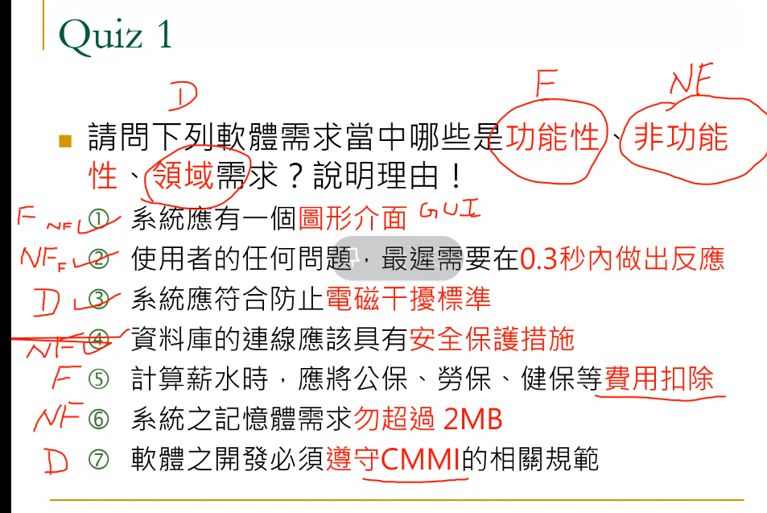
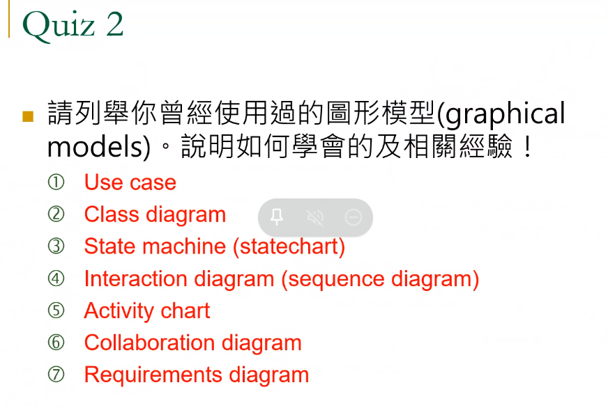
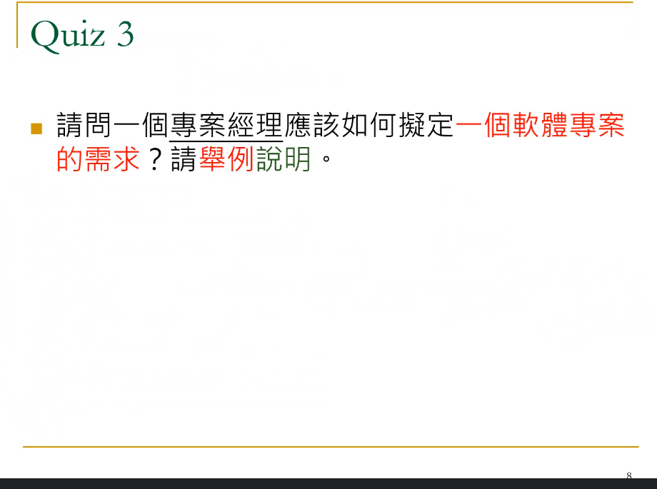
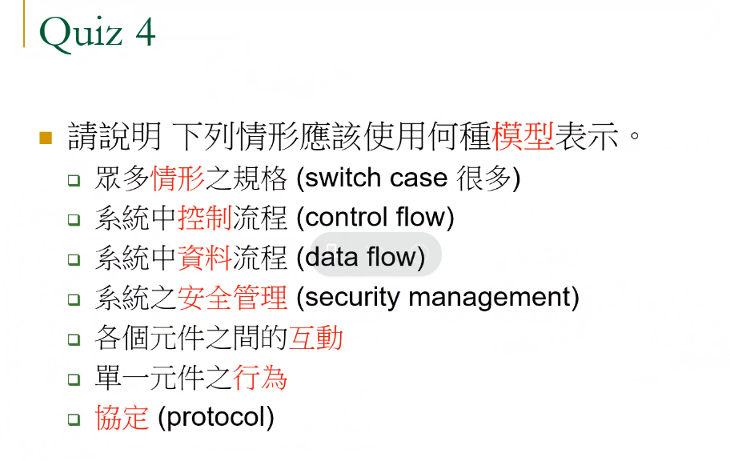
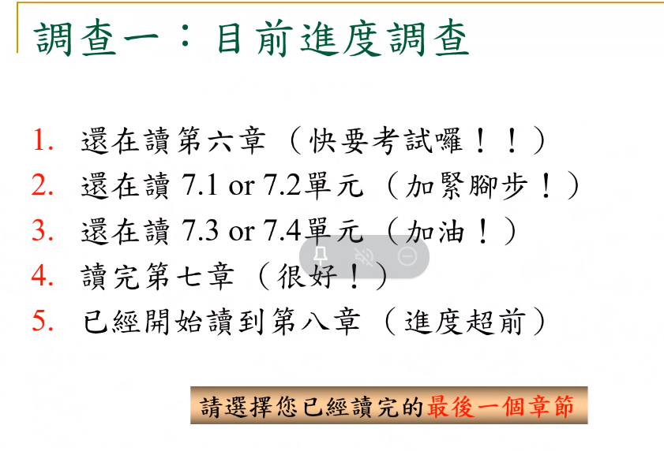

### 01



### 02



### 03



### 04


```
此類題必考，要說明原因，說服助教就有分數
F：功能性需求
NF：非功能性需求
D：領域需求
```

```
GUI 以前幾乎沒有，所以以前是NF，後來都是標準為 F
即時生的軟體。是D，不同的系統，時間限制都不一樣。
電磁干擾標準：領域性需求。
資料庫連線，安全保護，幾乎都是功能性，以前是非功能性。
計算薪水，扣除是功能性
記憶體之需求（空間）非功能性
CMMI，公司有需求，為領域性

```

### 05



### 06


```
用例圖
類別圖，畫出架構
狀態圖，常見，有限狀態機
互動圖，物件跟物件的互動
活動圖
合作圖
需求分析
```

### 07



### 08



```
Switch case 很多：用 EXCEL 列表，開清單，避免漏掉。
control flow: 流程圖
data flow : 資料流程圖
security management:去銀行提款，有一定的流程，很多關卡。而不是去金庫提款。
                    用同心圓、金字塔圖，層層保護
各個元件之間的互動：互動圖，物件跟物件的互動
單一元件之行為：狀態圖，常見，有限狀態機
protocol:合作圖
```

### 09



### 10


### 11


### 12


### 13


### 14


### 15


### 16


### 17


### 18


### 19


### 20


### 21


### 22


### 23


### 24


### 25


### 26


### 27


### 28


### 29


### 30


### 31


### 32


### 33


### 34


### 35


### 36


### 37


### 38


