# 1.jpg
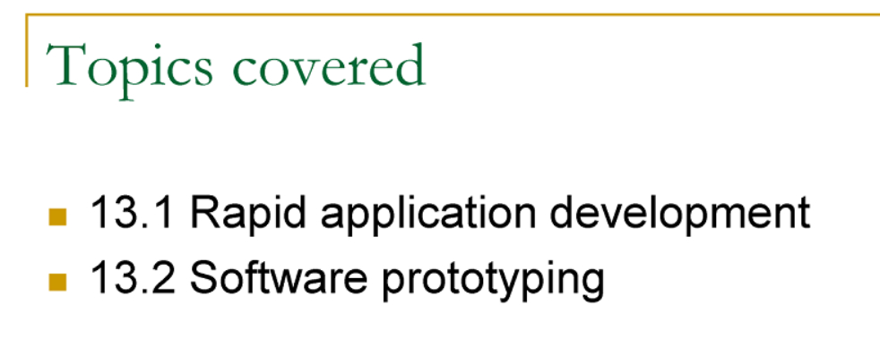

# 2.jpg
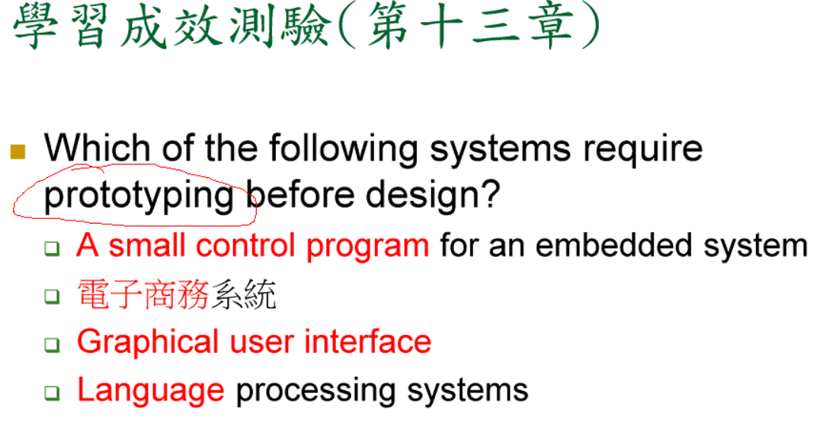

# 3.jpg
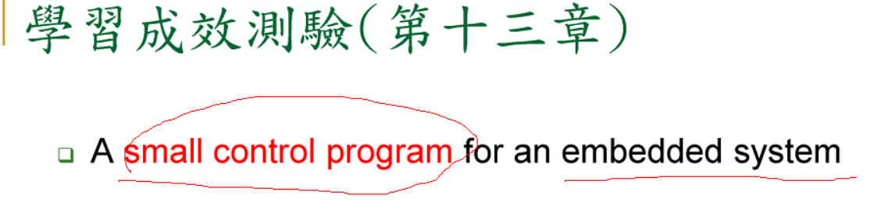

- 是否需要 prototyping 設計？
- 不需要，這是小的，控制程式，其實不需要什麼，prototyping 設計，最多畫流程圖。

# 4.jpg
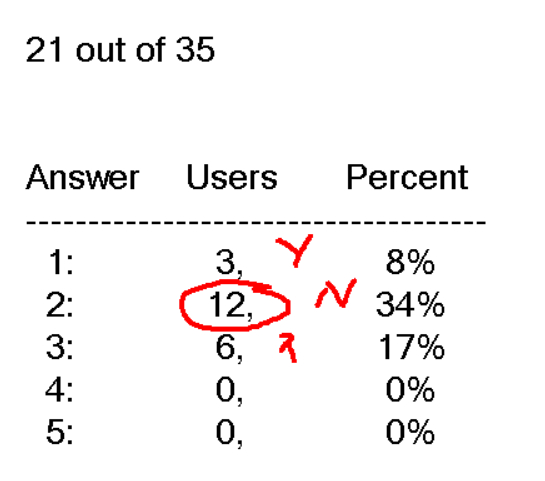

# 5.jpg
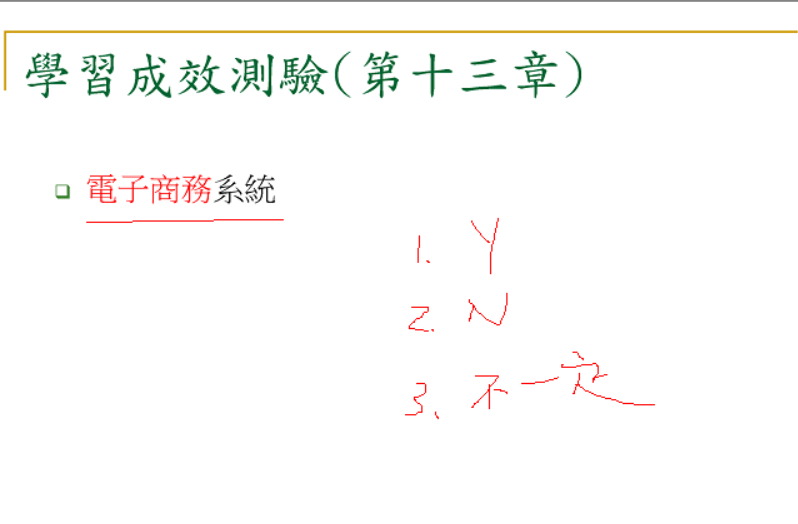

# 6.jpg
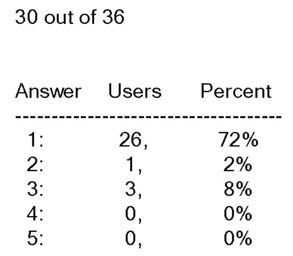

- 電子商務有物流、金流，很複雜，面向很多。所以要 prototyping 設計

# 7.jpg
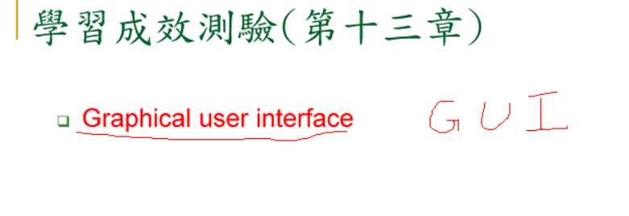

# 8.jpg
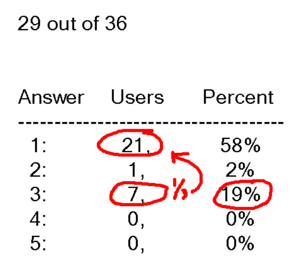

- 以前的GUI，要 prototyping 設計，因為視窗系統很少
- APP的設計也需要 prototyping 設計
  

# 9.jpg
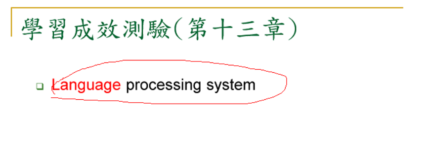

- 比如 SIRI，比如，網頁讀稿。
- 這邊很模糊，大部份會 prototyping 設計。
- YES 跟N○都可以

# 10.jpg
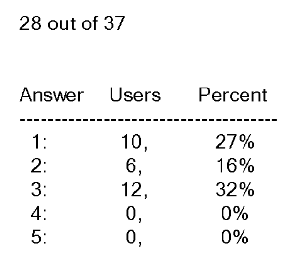

# 11.jpg
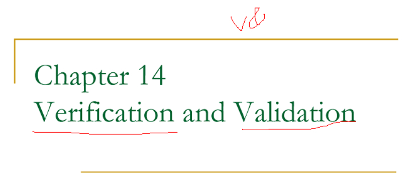

- Verification
  - 是否符合開發的規格
- Validation
  - 是否符合使用者需求。 
  - 老人跟年輕人的需求不一樣，不同的客群
  -  

# 12.jpg
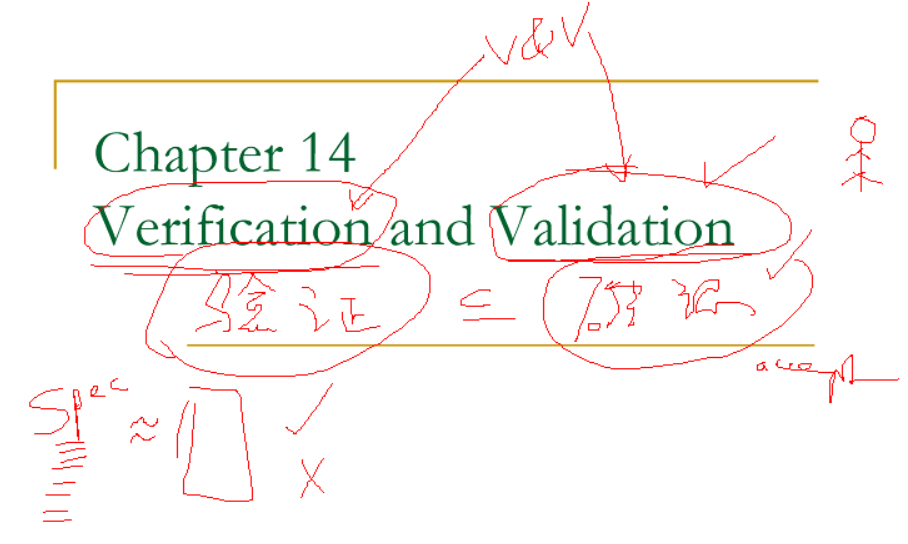

# 13.jpg
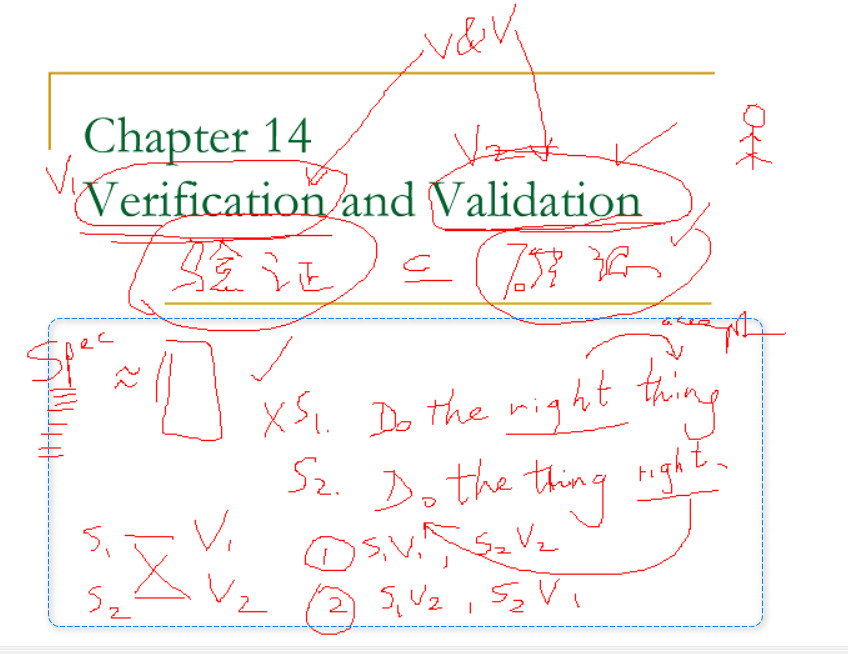

- Do the right thing. 做正確的事情
  - 這個 right 是形容詞
- Do the thing right. 
  - 這個 right 是副詞。

# 14.jpg
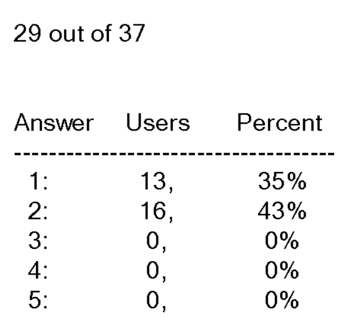

- 正確答案是：2

# 15.jpg

# 16.jpg

# 17.jpg
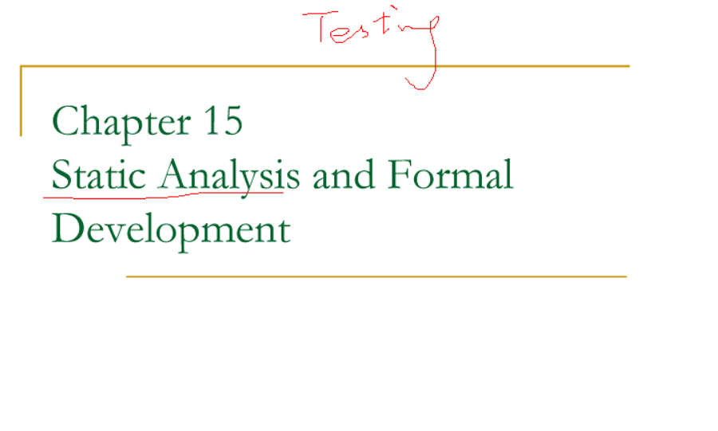

# 18.jpg
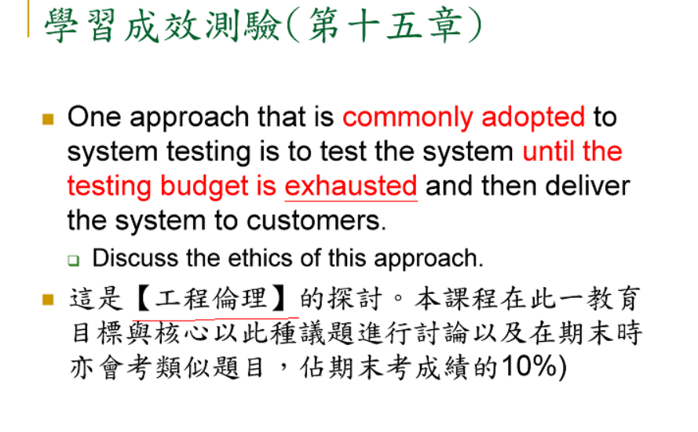

# 19.jpg
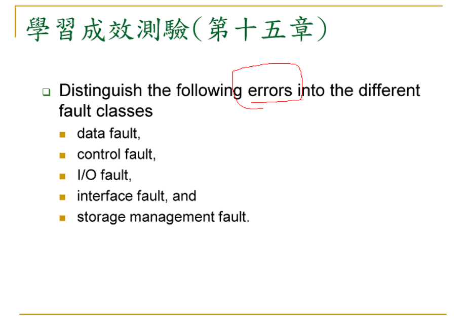

# 20.jpg
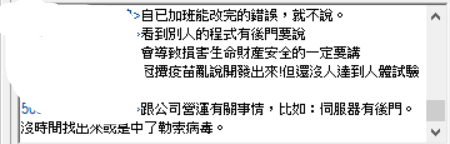

# 21.jpg
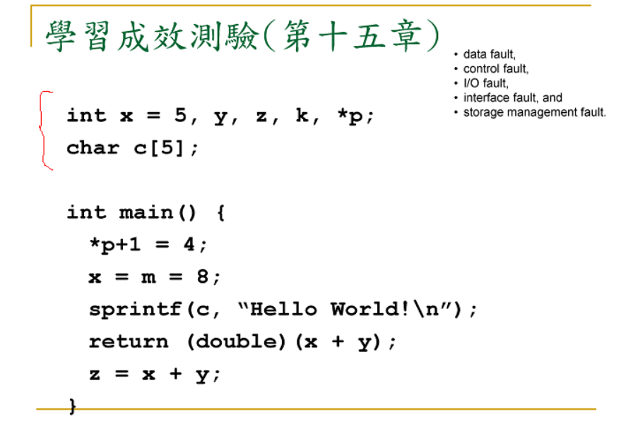

# 22.jpg
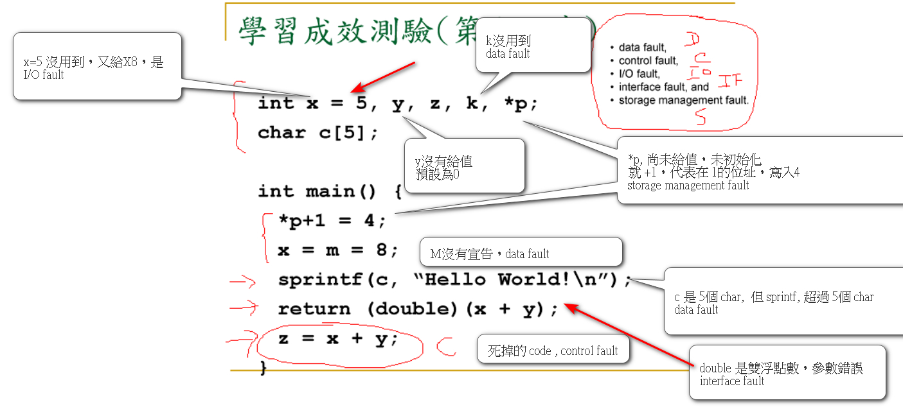

# 23.jpg
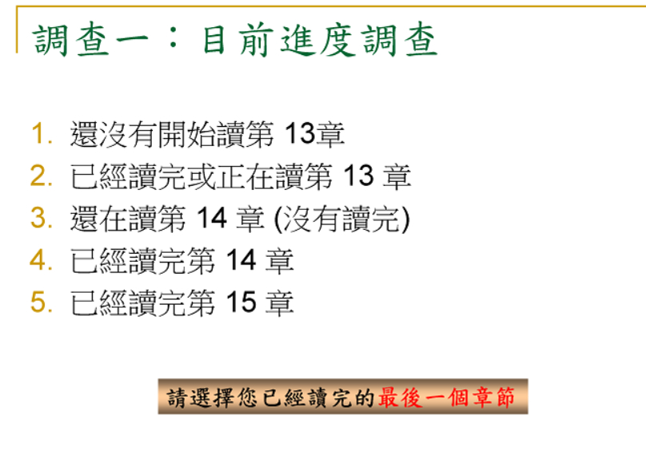

# 24.jpg
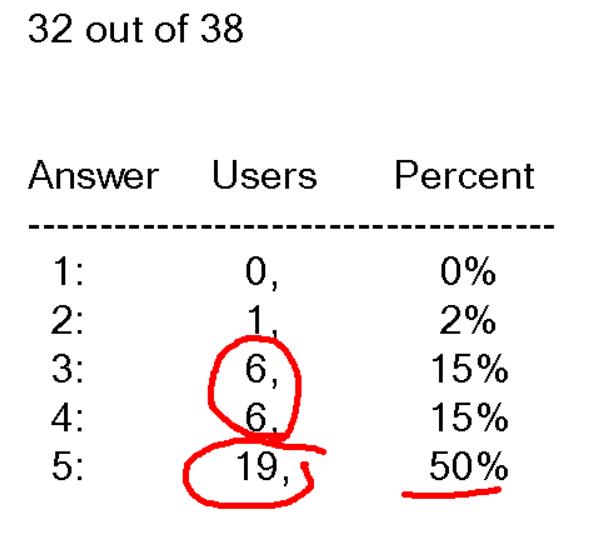

# 25.jpg
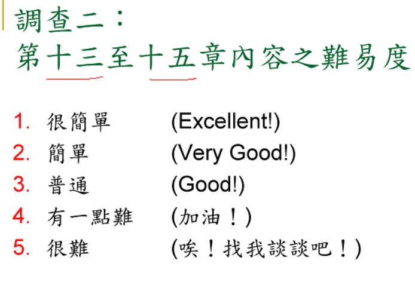

# 26.jpg

# 27.jpg

# 28.jpg

# 29.jpg

# 30.jpg

# 31.jpg

# 32.jpg

# 33.jpg

# 34.jpg

# 35.jpg

# 36.jpg

# 37.jpg

