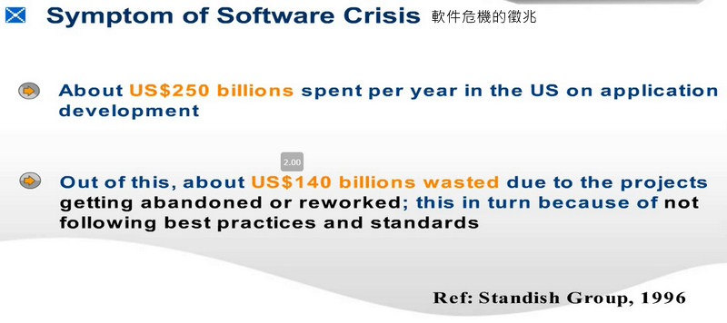
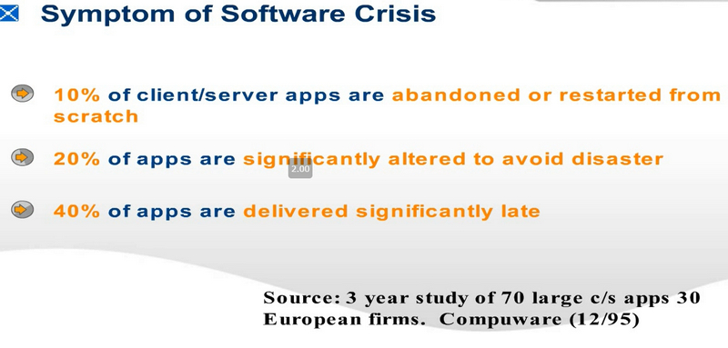
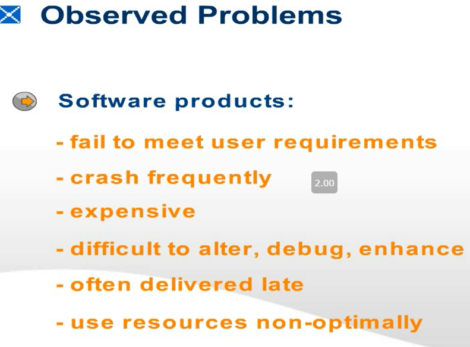
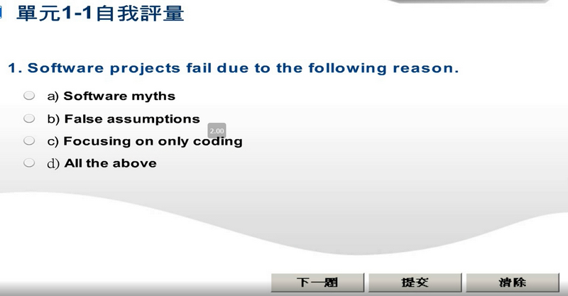

# The statistics – Chaos Report


On time, on budget, with all of the specified features and functions

> 具有預算，所有指定的特徵和功能

Cancelled before they were completed

>在完成之前取消

delivered and operational but over-budget, over-schedule or with fewer features and functions than

> 已交付並投入運營，但預算超支，計劃過度或特徵和功能少於

# Symptom of Software Crisis 軟件危機的徵兆

About US$250 billions spent per year in the US on application development
Out of this, about US$140 billions wasted due to the projects getting abandoned or reworked;
 this in turn because of not following best practices and standards

```
每年在美國花費約2500億美元用於應用程序開發
其中，由於項目被放棄或重做，浪費了約1400億美元。
這又是因為未遵循最佳做法和標準
```

# Symptom of Software Crisis


- 10% of client/server apps are abandoned or restarted from scratch 
- 20% of apps are significantly altered to avoid disaster
- 40% of apps are delivered significantly late 

```
-10％的客戶端/服務器應用被放棄或從頭開始重啟
-為避免災難，對20％的應用程序進行了重大更改
-40％的應用交付時間明顯晚
```

# Observed Problems 觀察到的問題


- Software products:
  - fail to meet user requirements
  - crash frequently
  - expensive
  - difficult to alter, debug, enhance
  - often delivered late
  - use resources non-optimally

```
-軟件產品：
  -無法滿足用戶要求
  -經常崩潰
  -昂貴
  -難以更改，調試，增強
  -經常遲到
  -非最佳地使用資源
```

# Why is the Statistics so Bad? 為什麼統計數據如此糟糕？
- Misconception on software development
  -  Software myths, e.g., the man-month myth
  -  False assumptions
  -  Not distinguishing the coding of a computer program from the development of a software product
- Software programs have exponential growth in complexity and difficulty level with respect to size.
  -  The ad hoc approach breaks down when size of software increases.

```
-對軟件開發的誤解
  -軟件神話，例如人工月神話
  -錯誤的假設
  -不區分計算機程序的編碼和軟件產品的開發
-軟件程序的複雜度和難度在規模上呈指數增長。
  -當軟件大小增加時，臨時方法會失效。
```

# Why is the Statistics so Bad?
- Software professionals lack engineering training
  - Programmers have skills for programming but without the engineering mindset about a process discipline
- Internal complexities
  - Essences and accidents made by Fred. Brooks

```
-軟件專業人員缺乏工程培訓
  -程序員具有編程技能，但沒有關於流程學科的工程思想
-內部複雜性
  -Fred的要點和意外。布魯克斯
```

# How is Software usually Constructed … 通常如何建構軟件？




```
1.軟件項目由於以下原因而失敗。
a）軟件神話
b）錯誤的假設
c）只專注於編碼
d）以上所有
```


```
2.臨時設計
非常大, 即使軟件變為複雜。
```


```
3.不同的利益相關者對衛星軟件產品可能有不同的看法。
```
