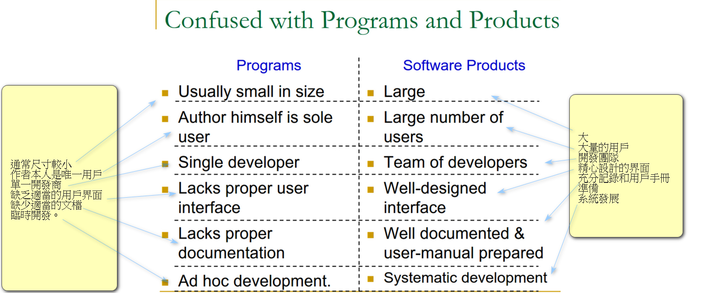
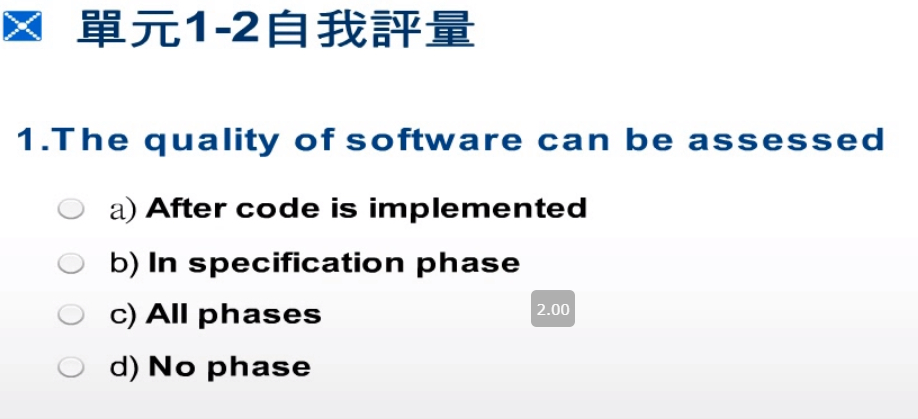
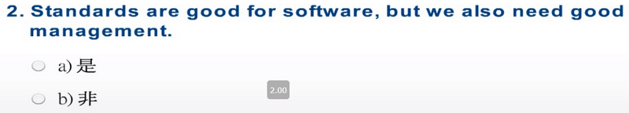
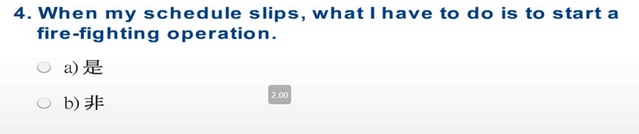

# Software Myths (Customer Perspectives) 人月神話，顧客觀點

- A general statement of objectives is sufficient to get started with the development of software. Missing/vague requirements can easily be incorporated/detailed out as they get concretized.
- Application requirements can never be stable; software can be and has to be made flexible enough to allow changes to be incorporated as they happen.

```
- 人月神話：軟體工作，不是加入越多人，越能解決問題
- 對目標的一般說明足以開始軟件開發。遺漏/含糊不清的要求可以在具體化時輕鬆納入/詳細說明。
- 應用需求永遠不會穩定；軟件可以而且必須足夠靈活，以允許在發生更改時將其合併。
```

# Software Myths (Developer Perspectives) 開發者觀點
Once the software is demonstrated, the job is done.

Usually, the problems just begin!

```
演示軟件後，就可以完成工作。
通常，問題才剛剛開始！
```

# Software Myths (Developer Perspectives)
Until the software is coded and is available for testing, there is no way for assessing its quality.

Usually, there are too many  tiny bugs inserted at every stage that grow in size and complexity as they progress thru further stages!

```
在對該軟件進行編碼並可以進行測試之前，無法評估其質量。
通常，在每個階段都會插入太多的小錯誤，這些小錯誤會隨著階段的發展而不斷增加，其大小和復雜性也隨之增加！
```

# Software Myths (Developer Perspectives)
The only deliverable for a software development project is the tested code.

The code is only the externally visible component of the entire software complement!

```
軟件開發項目的唯一可交付成果是經過測試的代碼。
代碼只是整個軟件補充的外部可見部分！
```

# Software Myths (Management Perspectives)
As long as there are good standards and clear procedures in my company, I shouldn’t be too concerned.

But the proof of the pudding is in the eating; 
not in the Recipe !

```
只要我公司有良好的標準和明確的程序，我就不必太擔心。
但是，布丁的證據在於飲食。
不在食譜中！
```

# Software Myths (Management Perspectives)
As long as my software engineers(!) have access to the fastest and the most sophisticated computer environments and state-of-the-art software tools, I shouldn’t be too concerned.

The environment is only one of the several factors that determine the quality of the end software product!

```
只要我的軟件工程師（！）可以使用最快，最複雜的計算機環境和最新的軟件工具，我就不必太擔心。
環境只是決定最終軟件產品質量的幾個因素之一！
```

# Software Myths (Management Perspectives)
When my schedule slips, what I have to do is to start a fire-fighting operation: add more software specialists, those with higher skills and longer experience - they will bring the schedule back on the rails!

Unfortunately, software business does not entertain schedule compaction beyond a limit!

```
當我的日程安排出現偏差時，我要做的就是開始一場消防行動：增加更多的軟件專家，讓他們擁有更高的技能和更長的經驗，他們將使時間表重新回到正軌！
不幸的是，軟件業務的進度壓縮不會超出限制！
```

# Misplaced Assumptions 錯誤的假設

- All requirements can be pre-specified
- Users are experts at specification of their needs
- Users and developers are both good at visualization
- The project team is capable of unambiguous communication

```
-所有要求都可以預先指定
-用戶是滿足其需求的專家
-用戶和開發人員都擅長可視化
-項目團隊具有明確的溝通能力
```

# Confused with Programs and Products
與程序和產品混淆




```
1 可以評估軟件的質量
a）實施代碼後
b）在規範階段
c）所有階段
d）無相
```


```
2.標準對於軟件是好的，但是我們也需要好的管理。
```


```
3.軟件項目唯一可交付的是經過測試的代碼。
```



```
4.時間表拖延後，我要做的就是開始滅火行動。
```
