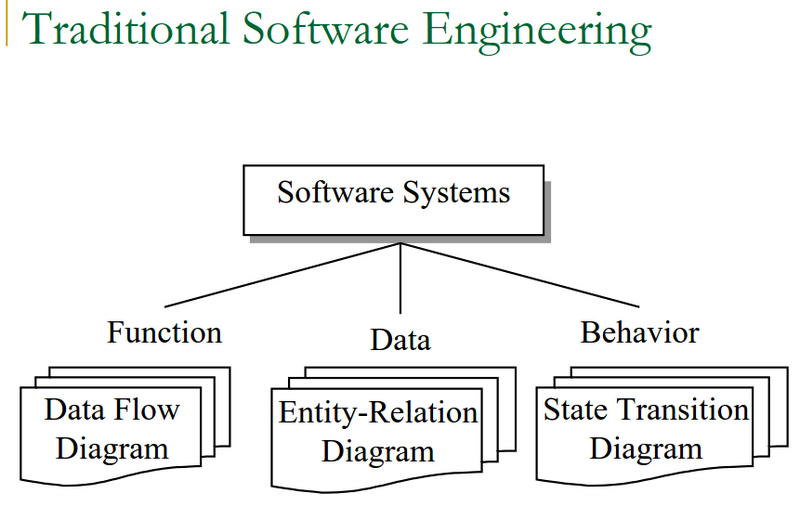
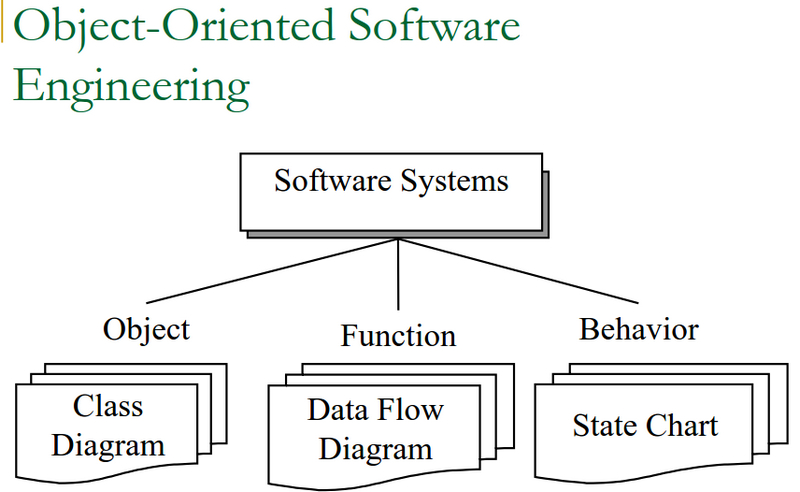
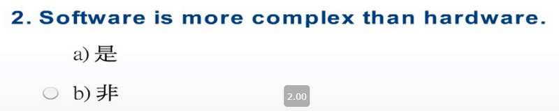
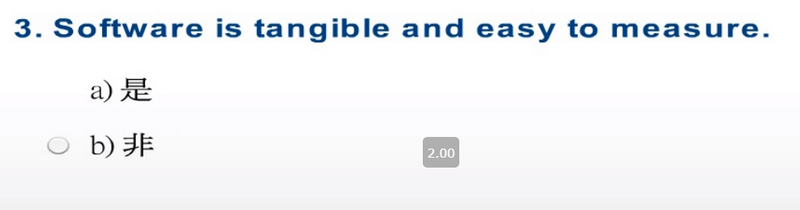
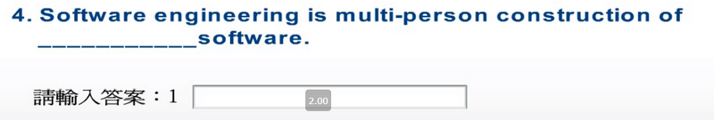
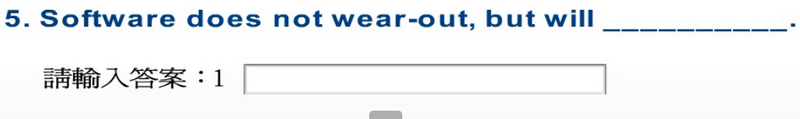

# Software Programming ≠ Software Engineering 
- Software programming: the process of translating a problem from its physical environment into a language that a computer can understand and obey. (Webster’s New World Dictionary of Computer Terms)
  - Single developer
  - “Toy” applications
  - Short lifespan
  - Single or few stakeholders
- Architect = Developer = Manager = Tester = Customer = User
  - One-of-a-kind systems
  - Built from scratch
  - Minimal maintenance

```
-軟件編程：將問題從其物理環境轉換為計算機可以理解和服從的語言的過程。 （韋伯斯特的《新世界計算機術語詞典》）
  -單一開發商
  -“玩具”應用
  -壽命短
  -單個或幾個利益相關者
-架構師=開發人員=經理=測試人員=客戶=用戶
  -獨一無二的系統
  -從頭開始
  -最少的維護
```

# Software Programming ≠ Software Engineering
- Software engineering
   - Teams of developers with multiple roles
   - Complex systems
   - Indefinite lifespan
   - Numerous stakeholders
- Architect ≠ Developer ≠ Manager ≠ Tester ≠ Customer ≠ User
   - System families
   - Reuse to amortize costs
   - Maintenance accounts for over 60% of overall development costs

```
- 軟件工程
   -具有多個角色的開發人員團隊
   -複雜的系統
   -無限期
   -眾多利益相關者
-架構師≠開發人員≠經理≠測試人員≠客戶≠用戶
   -系統系列
   -重用以攤銷成本
   -維護費用佔總開發成本的60％以上
```

# What is Software?
Software is a set of items or objects  that form a “configuration” that  includes 

- programs 
- documents
- data ...

("Software Engineering- a practitioner’s approach," Pressman, 5ed. McGraw-Hill)

```
軟件是形成“配置”的一組項目或對象，包括
-程式
-文件
-數據...
（“軟件工程-實踐者的方法，” Pressman，第5版。McGraw-Hill）
```
# What is Software?

Or you may want to say:

-  Software consists of 
  -  (1) instructions (computer programs) that when executed provided desired function and performance,
  -  (2) data structures that enable the programs to adequately manipulate information, and 
  -  (3) documents that describe the operation and use of the programs. 

```
或者您可能想說：
-軟件包括
  -（1）指令（計算機程序）在執行時提供了所需的功能和性能，
  -（2）使程序能夠充分操縱信息的數據結構，以及
  -（3）描述程序操作和使用的文件。
```

# What is Software (ctd.)?

But these are only the concrete part of software that may be seen, there exists also `invisible part` which is more important:
-  Software is the `dynamic behavior` of programs on real computers and auxiliary equipment.
-  “… a software product is a `model` of the real world, and the real world is `constantly changing`.”
-  Software is a `digital form of knowledge`. (“Software Engineering,” 6ed. Sommerville, Addison-Wesley, 2000)

```
但是，這些只是可以看到的軟件的具體部分，還有更重要的不可見部分：
- 軟件是真實計算機和輔助設備上程序的動態行為。
- “……軟件產品是真實世界的模型，真實世界在不斷變化。”
- 軟件是知識的數字形式。 （“軟件工程”，第6版，Sommerville，Addison-Wesley，2000年）
```

# Unique Characteristics of Software
- Software is malleable
- Software construction is human-intensive
- Software is intangible and hard to measure
- Software problems are usually complex
- Software directly depends upon the hardware
  - It is at the top of the system engineering “food chain”
- Software doesn’t wear out but will deteriorate
- Software solutions require unusual rigor
- Software has discontinuous operational nature

```
＃軟件的獨特特性
-軟件具有延展性
-軟件構建需要大量人力
-軟件無形且難以衡量
-軟件問題通常很複雜
-軟件直接取決於硬件
  -它位於系統工程“食物鏈”的頂部
-軟件不會磨損，但會退化
-軟件解決方案要求異常嚴格
-軟件具有不連續的操作性質
```

# Casting the Term
- The field of software engineering was born in NATO Conferences, 1968 in response to chronic failures of large software projects to meet schedule and budget constraints
- Since then, term became popular because software is getting more and more important to industry and business but the “software crisis” still persists.

```
強制術語
-1968年北約會議誕生了軟件工程領域，以應對大型軟件項目長期未能滿足計劃和預算限制的情況
-從那時起，術語變得流行，因為軟件對工業和商業越來越重要，但是“軟件危機”仍然持續。
```

# What is Software Engineering?

- Different focuses for this term exist in various textbooks. Some are listed below.
- The application of a systematic, disciplined, quantifiable approach to development, operation, and maintenance of software; that is, the application of engineering to software. (IEEE Standard Computer Dictionary, 610.12, ISBN 1-55937-079-3, 1990)

```
-各種教科書中都有不同的重點。下面列出了一些。
-在軟件的開發，操作和維護中應用系統，規範，可量化的方法；即工程學在軟件中的應用。 （IEEE標準計算機詞典，610.12，ISBN 1-55937-079-3，1990）
```

# What is Software Engineering? (ctd)

- Software engineering is concerned with the theories, methods and tools for developing, managing and evolving software products. (I. Sommerville, 6ed.)
- A discipline whose aim is the production of quality software, delivered on time, within budget, and satisfying users' needs. (Stephen R. Schach, Software Engineering, 2ed.)
- Multi-person construction of multi-version software (Parnas, 1987)

```
-軟件工程涉及用於開發，管理和發展軟件產品的理論，方法和工具。 （I. Sommerville，第6版。）
-一門學科，其目標是在預算範圍內按時交付高質量軟件並滿足用戶需求。 （Stephen R. Schach，軟件工程，第二版。）
-多人構建多版本軟件（Parnas，1987年）
```

# What is Software Engineering? (ctd.)

- The practical application of scientific knowledge in the design and construction of computer programs and the associated documentation required to develop, operate and maintain them (B.W. Boehm)
- The establishment and use of sound engineering principles in order to obtain economically software that is reliable and works efficiently on real machines (F.L. Bauer)

```
-科學知識在計算機程序的設計和構建中的實際應用以及開發，操作和維護它們所需的相關文檔（B.W. Boehm）
-建立和使用合理的工程原理，以便獲得經濟可靠且在實際機器上有效運行的軟件（F.L. Bauer）
```

# What is Software Engineering? (ctd.)

- The technological and managerial discipline concerned with systematic production and maintenance of software products that are developed and modified on time and within cost constraints (R. Fairley)
- A discipline that deals with the building of software systems which are so large that they are built by a team or teams of engineers (Ghezzi, Jazayeri, Mandrioli)

```
-與軟件產品的系統化生產和維護有關的技術和管理學科，這些軟件產品可以在成本限制內按時開發和修改（R. Fairley）
-涉及軟件系統構建的學科，該系統是如此之大，以至由一個或多個工程師團隊（Ghezzi，Jazayeri，Mandrioli）構建
```

# Other Definitions of Software Engineering
- “A systematic approach to the analysis, design, implementation and maintenance of software.” (The Free On-Line Dictionary of Computing)
- - “The systematic application of tools and techniques in the development of computer-based applications.” (Sue Conger in The New Software Engineering)
- “Software Engineering is about designing and developing high-quality software.” (Shari Lawrence Pfleeger in Software Engineering -- The Production of Quality Software)

```
＃軟件工程的其他定義
-“一種用於軟件分析，設計，實施和維護的系統方法。” （免費的在線計算詞典）
-“在基於計算機的應用程序開發中工具和技術的系統應用。” （新軟件工程中的Sue Conger）
-“軟件工程與設計和開發高質量軟件有關。” （軟件工程中的Shari Lawrence Pfleeger-優質軟件的生產）
```

# So, Software Engineering is …
- Scope
  - study of software process, development principles, techniques, and notations
- Goals
  - production of quality software, 
  - delivered on time, 
  - within budget, 
  - satisfying customers’ requirements and users’ needs

```
- 範圍
  -研究軟件過程，開發原理，技術和符號
-目標
  -生產優質軟件，
  -準時交貨，
  - 在預算之內，
  -滿足客戶的要求和用戶的需求
```

# Software Process
- Waterfall life cycle
- Prototyping
- Spiral model
- Automatic synthesis model
- Object-oriented model
- 4 GL model

```
-瀑布生命週期
-原型製作
-螺旋模型
-自動綜合模型
-面向對象的模型
-4 GL模型
```

# Traditional Software Engineering



# Object-Oriented Software Engineering




1.“軟件工程”一詞的產生是：(A)


2.軟件比硬件更複雜。(YES)


3.軟件有形且易於度量。


4.軟件工程是多人構建的
- Multi-person construction of `multi-version` software (Parnas, 1987)



5.軟件不會磨損，但會磨損
- Software doesn’t wear out but will `deteriorate`

