# Chapter 2

Software Engineering History and State-of-Art 

> 軟件工程的歷史和最新狀態

# Evolution of Software Industry
- Independent Programming Service
- Software Product
- Enterprise Solution
- Packaged Software for the Mass
- Internet software and services

```
＃軟件行業的演變
-獨立編程服務
-軟件產品
-企業解決方案
-面向大眾的打包軟件
```

# Independent Programming Services (Era 1)
- Feb 1955, Elmer Kubie and John Sheldon founded CUC 
  - the First Software Company that devoted to the construction of software especially for hardware company. 
- Promoting Software Industry: two Major Projects,
  - SABRE, airline reservation system, $30 million.
  - SAGE, air defense system (1949~1962) 700/1000 programmers in the US. $8 billion.

```
＃獨立編程服務（時代1）
-1955年2月，埃爾默·庫比（Elmer Kubie）和約翰·謝爾頓（John Sheldon）創立了CUC
  -第一家致力於為硬件公司開發軟件的軟件公司。
-促進軟件產業：兩個重大項目，
  -SABRE，航空公司預訂系統，3000萬美元。
  -SAGE，防空系統（1949〜1962）美國的700/1000程序員。 80億美元。
```

# Software Product (Era 2)
- 1964 Martin Goetz developed Flowchart Software -- Autoflow for RCA, but rejected.
  - Sale to the customer of RCA & IBM.
  - Develop and market software products not specifically designed for a particular hardware platform.
- MARK IV, a pre-runner for the database management system.
- IBM unbundled software from hardware.

```
＃軟件產品（時代2）
-1964年，馬丁·格茨（Martin Goetz）為RCA開發了流程圖軟件-Autoflow，但遭到拒絕。
  -銷售給RCA和IBM的客戶。
  -開發和銷售不是專門為特定硬件平台設計的軟件產品。
-MARK IV，數據庫管理系統的先行者。
-IBM從硬件中取消捆綁軟件。
```

# Enterprise Solutions (Era 3)
- Dietmar Hopp. IBM Germany
  - Systems, Applications and Products (SAP) $3.3billion (1997)
  - Setting up shop in Walldorf, Germany.
  - Marked by the emergence of enterprise solutions providers.
  - e.g. Baan 1978. Netherlands. $680 million (1997) Oracle 1977. U.S. Larry Ellison.
  - ERP, $45 billion (1997)

```
＃企業解決方案（時代3）
-Dietmar Hopp。 IBM德國
  -系統，應用程序和產品（SAP）33億美元（1997年）
  -在德國沃爾多夫開設商店。
  -以企業解決方案提供商的出現為標誌。
  -例如Baan 1978年。荷蘭。 6.8億美元（1997），Oracle1977。美國拉里·埃里森。
  -ERP，450億美元（1997）
```

# Packaged Software for the Masses (Era 4)
- Software products for the masses. 1979.
  - VisiCalc, Spreadsheet program.
- August 1981: The deal of the century.
  - Bill Gates bought the first version of the OS from a small firm called Seattle Computer Products for $50,000 without telling them it was for IBM.
  - The development of the IBM PC, 1981, initiated a 4th software era.
- PC-based mass-market software. Few additional services are required for installation. 
  - Microsoft reached revenues of $11.6 billion. Packaged Software Products, $57 billion (1997)

```
＃面向大眾的打包軟件（時代4）
-面向大眾的軟件產品。 1979年。
  -VisiCalc，電子表格程序。
1981年8月：本世紀的交易。
  -比爾·蓋茨以5萬美元的價格從一家名為Seattle Computer Products的小公司購買了該操作系統的第一版，而沒有告知它們是針對IBM的。
  -1981年IBM PC的發展開啟了第4個軟件時代。
-基於PC的大眾市場軟件。安裝幾乎不需要其他服務。
  微軟的收入達到了116億美元。打包軟件產品，570億美元（1997年）
  ```

# Internet Software and Services (Era 5)

- Internet and value-added services period, 1994. W
  - with Netscape’s browser software for the internet.

```
＃互聯網軟件和服務（時代5）

-互聯網和增值服務期，1994年。W
  -使用Netscape的互聯網瀏覽器軟件。
```
# Evolution of Design Techniques

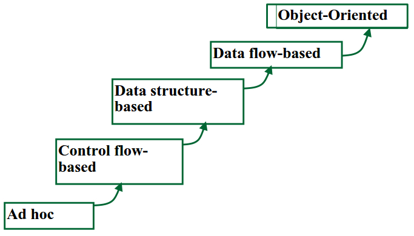

# Related Knowledge

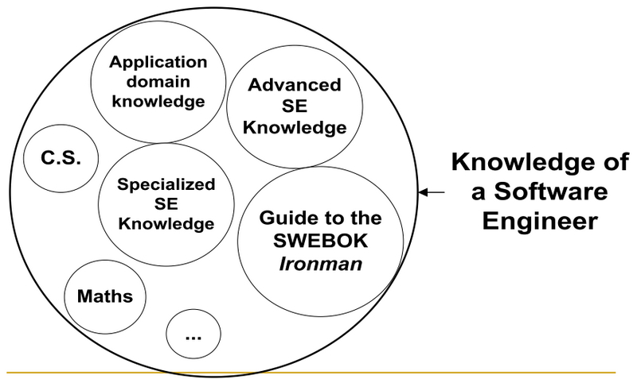

# IT Market
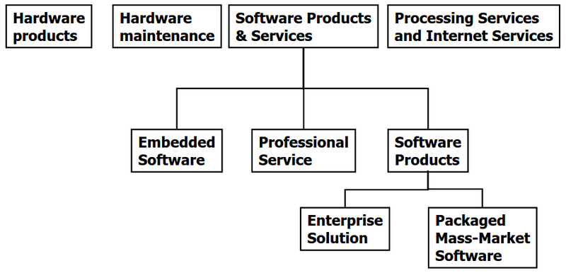

# Software Products and Services


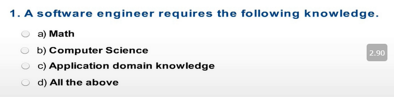
```
I.軟件工程師需要具備以下知識。
a）數學
b）計算機科學
c）應用領域知識
d）以上所有
```
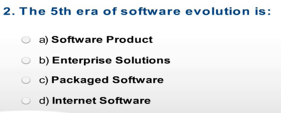

```
2.軟件發展的第五個時代是：
a）軟件產品
b）企業解決方案
c）打包軟件
d）互聯網軟件
```


```
3.硬件產品和軟件產品均屬於IT市場。
```


# Software Engineering Today?

- Organizations “go with what has worked in the past”
- Everyone is too busy getting product out the door to spend time in education or training or addressing these problems effectively 
- “Out of date” practices become institutionalized

```
＃今天的軟件工程？
-組織“繼續研究過去的工作”
-每個人都太忙於將產品拿出門，無法花時間進行教育或培訓或有效解決這些問題
-“過時”的做法已製度化
```


# Software Engineering Today?
- Few people know, or can integrate, best practices 
  -  Unable to adopt and utilize proven methodologies in timely fashion
-  Although significant improvements have been made in specific areas, the rapidly evolving nature of the software industry has resulted in little overall improvement in the overall situation.

```
-很少有人知道或可以整合最佳做法
  -無法及時採用和利用行之有效的方法
-儘管在特定領域已取得重大進步，但是軟件行業的快速發展本質導致總體情況的總體改善很少。
```

# Not Crisis, but a Chronic Problem
- The crisis persists
  - After 35 years later, the software “crisis” is still with us
  - Major problems are still the same:
- poor quality (correctness, usability, maintainability, etc)
- over budget
- delivered late, or not at all
- It is not a crisis but a chronic problem
  - It becomes a persistent, chronic condition that software industry has to face with

```
＃不是危機，而是一個長期問題
-危機依然存在
  -35年後，“危機”軟件仍然存在
  -主要問題仍然相同：
-質量差（正確性，可用性，可維護性等）
- 超過預算
-交貨遲到或根本沒有交貨
-不是危機，而是一個長期的問題
  -它成為軟件行業必鬚麵對的持續，長期的狀況
```

# What’s Wrong?
- Does software engineering have no progress at all? Not quite true.
  - We have indeed seen a lot of improvements, e.g. high level programming, object-oriented technology, etc.
- But it does not achieve its promise, why? 
  - production of fault-free software, delivered on time and within budget, that satisfies the users’ needs, and is easy to maintain, etc.

```
＃ 怎麼了？
-軟件工程完全沒有進展嗎？不太正確。
  -我們確實看到了很多改進，例如高級編程，面向對象技術等
-但是它沒有實現其諾言，為什麼呢？
  -可以按用戶要求並在預算內按時交付無故障軟件，並且易於維護等。
```
# A More Close Look
- The comparison with 1995’s report does show that there is some progress in the past eight years.

```
＃仔細觀察
-與1995年報告的比較確實表明，過去八年中取得了一些進展。
```

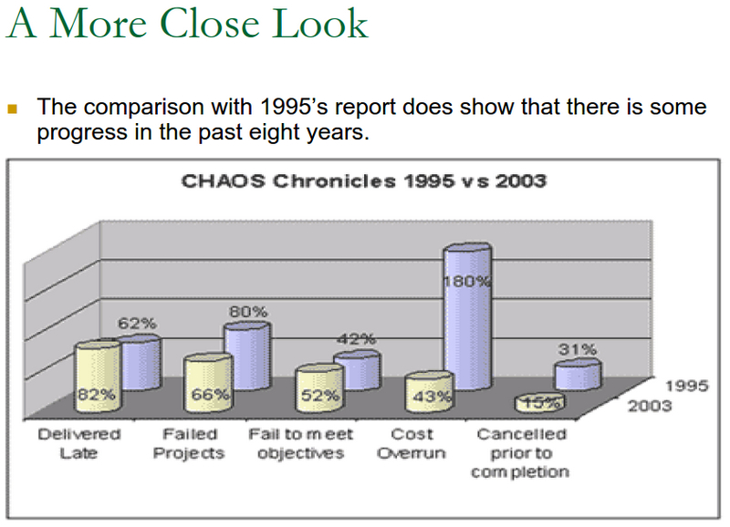

# So, What’s the Problem?
- Software issues: software industry has changes a lot in the past years
- Education issue: more emphasis on methods and tools but lack of sufficient education and training on people 
- Process and quality issue: there lacks of a set of known proven practices for software engineers to follow with

```
＃ 所以有什麼問題？
-軟件問題：軟件行業在過去幾年中發生了很大變化
-教育問題：更多地強調方法和工具，但缺乏對人的充分教育和培訓
-流程和質量問題：軟件工程師缺乏一套已知的可靠實踐來遵循
```

# Software Changes in the Past Years

過去幾年中的軟件更改

- Changes in software over time:
  - grew in size from 10’s or 100’s of lines to 1000’s to 1,000,000’s of lines of code
  - operating environment changed from simple “batch” operations to complex multiprogramming systems, to time-sharing and distributed computing to today’s Internet network computing environment.

```
-隨時間變化的軟件：
  -大小從10或100行增加到1000到1,000,000行
  -操作環境已從簡單的“批處理”操作變為複雜的多編程系統，再到了分時和分佈式計算，再到當今的Internet網絡計算環境。
```

# Software Changes in the Past Years
- As computer systems (both hardware and software) have become larger and more complex, the software development process has also become more and more complex 
  - the simple art of “programming in the small” is no longer capable of coping with the task.

```
＃過去幾年中的軟件更改
-隨著計算機系統（包括硬件和軟件）變得越來越大和越來越複雜，軟件開發過程也變得越來越複雜
  -“以小規模編程”的簡單技巧不再能夠應付任務。
```

# Situations for Software are Different Too
- Driven by intense market forces, including persistent pressure to deliver software on unrealistic time schedules
  - Rapidly changing requirements
  - Pressures for faster time to market
- Continuing rapid evolution of software methodologies and systems
  - Integration of new processes and techniques
  - Need to re-design major systems

```
＃軟件情況也不同
-在激烈的市場力量的推動下，包括在不切實際的時間表上交付軟件的持續壓力
  -快速變化的需求
  -加快上市時間的壓力
-軟件方法和系統的持續快速發展
  -整合新工藝和技術
  -需要重新設計主要係統
```

# Situations for Software are Different Too
- Talent shortage: needed software engineering skills often in short supply
- What even worse
  - Moore’s law means always trying new things
  - Complexity moves into software
  - Can’t find the limits except by trial and error

```
＃軟件情況也不同
-人才短缺：所需的軟件工程技能經常短缺
-更糟的是
  -摩爾定律意味著總是嘗試新事物
  -複雜性進入軟件
  -除非經過反複試驗，否則找不到限制
```

# The Software Industry Today
- Even though much is now known about how to improve software production, the overall state is not much better than ever, due to the urgency of meeting unrealistic delivery schedules and the continuing rapid evolution of the software industry  
  - i.e. poor quality, late delivery, over budget

```
＃當今的軟件行業
-儘管現在人們對如何改善軟件生產知之甚少，但是由於迫切需要滿足不切實際的交付時間表以及軟件行業的持續快速發展，總體狀況並沒有比以往任何時候都好
  -即質量差，交貨延遲，超出預算
```

# The Software Industry Today

- Component-Based Engineering and Integration
- Technological Heterogeneity
- Enterprise Heterogeneity
- Greater potential for Dynamic Evolution
- Internet-Scale Deployment
- Many competing standards
- Much conflicting terminology

```
-基於組件的工程和集成
-技術異質性
-企業異質性
-動態發展的更大潛力
-互聯網規模的部署
-許多競爭標準
-大量矛盾的術語
```

# The Current State of Software Engineering
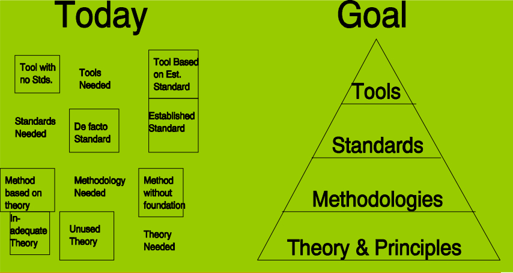

# Three key Challenges
Software engineering in the 21st century faces three key challenges:
- Legacy systems
  - Old, valuable systems must be maintained and updated
- Heterogeneity
  - Systems are distributed and include a mix of hardware and software
- Delivery
  - There is increasing pressure for faster delivery of software

```
＃三大挑戰
21世紀的軟件工程面臨三個主要挑戰：
-舊版系統
  -必須維護和更新舊的，有價值的系統
-異質性
  -系統是分佈式的，包括硬件和軟件的混合
- 交貨
  -加快軟件交付的壓力越來越大
```

# Ever-Present Difficulties
- Few guiding scientific principles
- Few universally applicable methods
- As much
  - managerial / psychological / sociological as technological

```
＃永遠存在的困難
-很少指導科學原則
-很少有普遍適用的方法
- 盡可能多
  -技術上的管理/心理/社會學
```

# SE的未來……


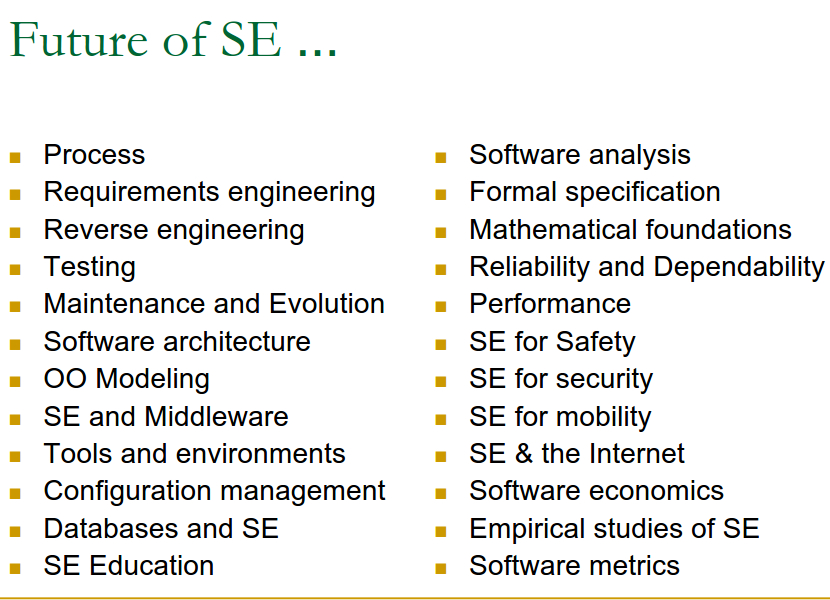

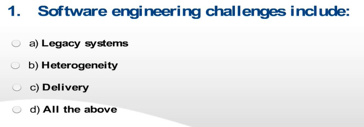
1.軟件工程包括：

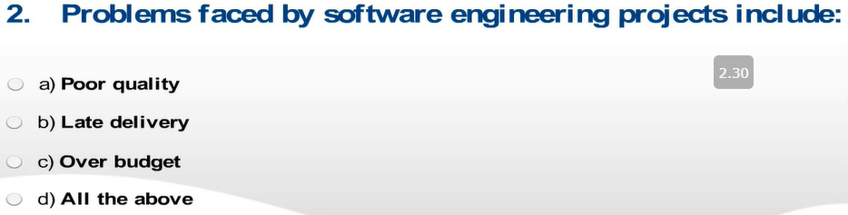
2.軟件面臨的問題包括：

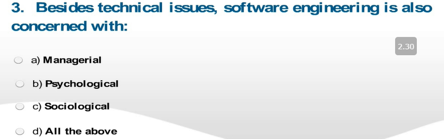
3.除了技術問題外，軟件工程還涉及
